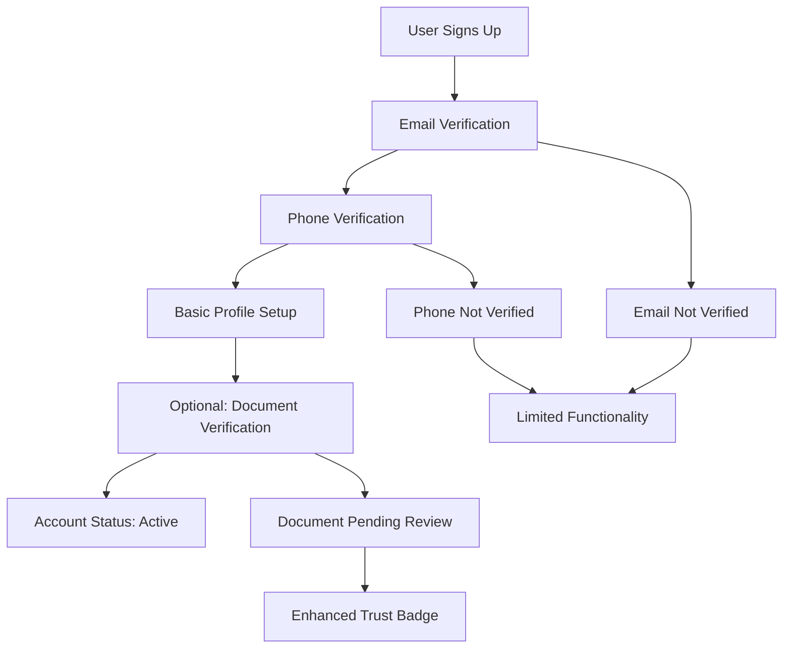
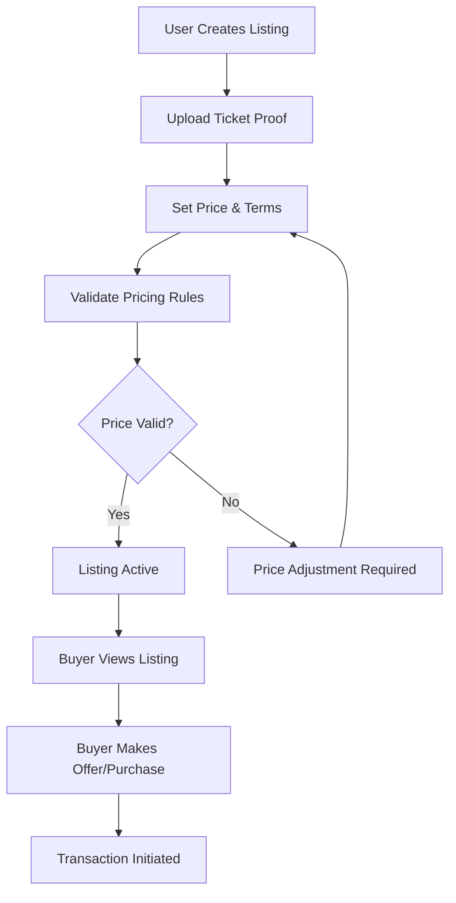
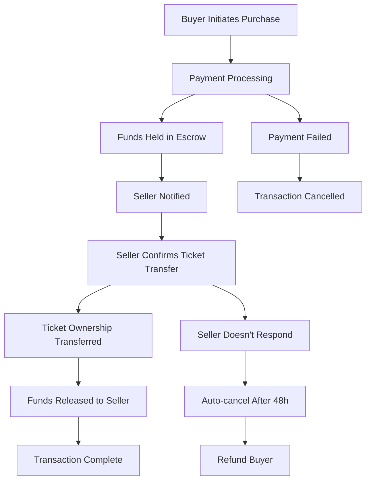
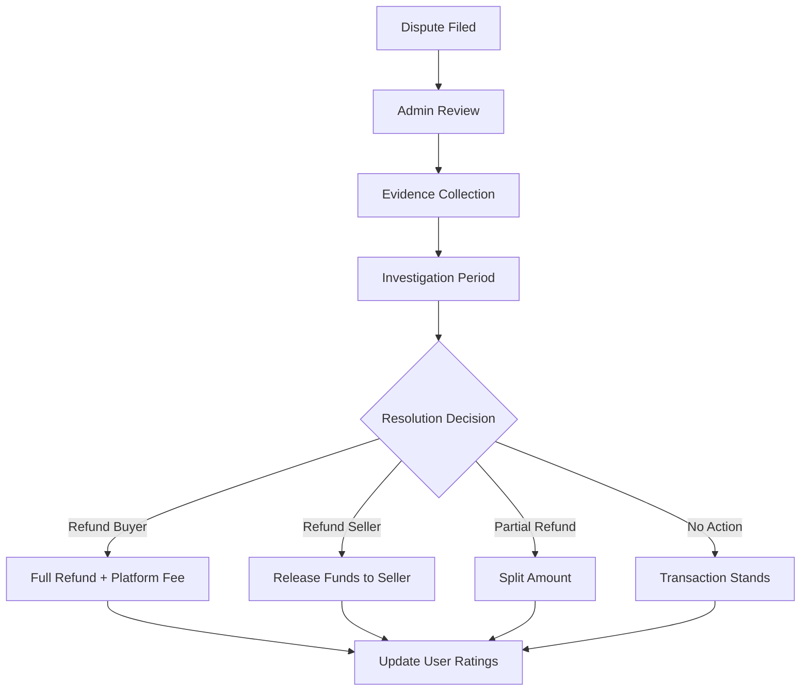
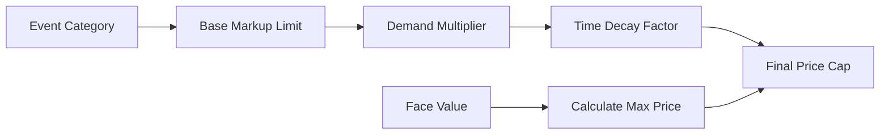
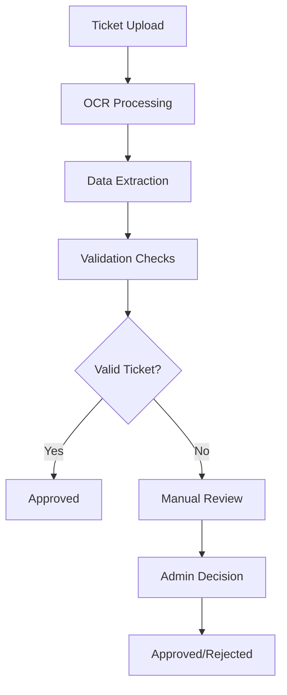
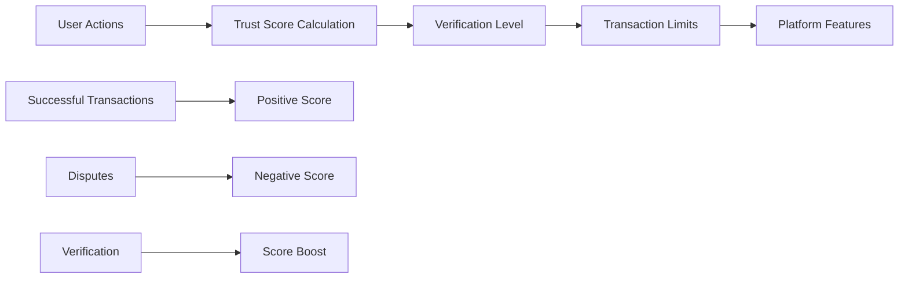

# Business Logic & Workflows

## Overview

This document outlines the core business logic, workflows, and rules that govern the ticket reselling platform operations.

## Core Workflows

### 1. User Registration & Verification

**Business Rules:**
- Users can browse and search without verification
- Email verification required for creating listings
- Phone verification required for transactions
- Document verification optional but provides trust badges
- Unverified accounts have limited functionality

### 2. Ticket Listing Process

**Business Rules:**
- Maximum markup: 20% above face value (configurable)
- Minimum listing duration: 24 hours
- Maximum listing duration: 30 days
- Price validation against market rates
- Automatic expiration handling

### 3. Transaction Flow

**Business Rules:**
- Escrow system for all transactions
- 48-hour response window for sellers
- Automatic refund if seller doesn't respond
- Platform fee: 5-10% (configurable by event type)
- Payment methods: Credit card, bank transfer, digital wallets

### 4. Dispute Resolution

**Business Rules:**
- 7-day window to file disputes
- Admin review within 48 hours
- Evidence submission required
- User rating impact for repeated disputes
- Escalation to higher-level admin if needed

## Pricing Strategy

### 1. Dynamic Pricing Rules

**Pricing Components:**
- **Base markup limit**: 20% for concerts, 15% for sports, 25% for festivals
- **Demand multiplier**: Based on search volume and favorites
- **Time decay**: Price decreases as event date approaches
- **Market saturation**: Price caps when many similar tickets available

### 2. Platform Fee Structure

| Transaction Type | Platform Fee | Notes |
|------------------|--------------|-------|
| Peer-to-peer | 8% | Standard fee |
| Official resale | 5% | Reduced fee for organizers |
| High-value (>$500) | 6% | Reduced fee for premium tickets |
| First-time seller | 5% | Promotional rate |

## Security & Fraud Prevention

### 1. Ticket Validation

**Validation Rules:**
- OCR processing for ticket images
- Cross-reference with event database
- Check for duplicate listings
- Validate ticket format and barcode
- Manual review for suspicious tickets

### 2. User Trust System

**Trust Score Factors:**
- Successful transactions: +10 points each
- Disputes: -20 points each
- Document verification: +50 points
- Account age: +1 point per month
- Response time: +5 points for <2 hours

## Notification System

### 1. Transaction Notifications

| Event | Recipient | Channel | Timing |
|-------|-----------|---------|--------|
| Listing created | Followers | Email/Push | Immediate |
| Purchase initiated | Seller | SMS/Email | Immediate |
| Payment received | Seller | Email | Immediate |
| Ticket transferred | Buyer | Email/SMS | Immediate |
| Transaction complete | Both | Email | Immediate |
| Dispute filed | Both | Email/SMS | Immediate |

### 2. Marketing Notifications

| Type | Trigger | Audience | Frequency |
|------|---------|----------|-----------|
| Price drops | Listing price reduced | Watchers | Immediate |
| Event reminders | 24h before event | Ticket holders | Daily |
| New listings | Similar to user preferences | Subscribers | Daily digest |
| Promotional | Special offers | Opt-in users | Weekly |

## Analytics & Reporting

### 1. Key Metrics

**Business Metrics:**
- Gross Merchandise Value (GMV)
- Platform fee revenue
- Transaction success rate
- Average ticket price
- User acquisition cost

**User Metrics:**
- Active users (daily/monthly)
- User retention rate
- Average session duration
- Conversion rate (browse to buy)
- User satisfaction score

**Operational Metrics:**
- Dispute resolution time
- Customer support response time
- System uptime
- Payment processing time
- Fraud detection rate

### 2. Reporting Schedule

| Report Type | Frequency | Recipients | Purpose |
|-------------|-----------|------------|---------|
| Daily sales | Daily | Management | Operational oversight |
| Weekly trends | Weekly | Product team | Feature optimization |
| Monthly financial | Monthly | Finance | Revenue tracking |
| Quarterly business | Quarterly | Stakeholders | Strategic planning |

## Compliance & Legal

### 1. Data Protection

**GDPR Compliance:**
- User consent management
- Data portability
- Right to be forgotten
- Data retention policies
- Privacy by design

**PCI DSS Compliance:**
- Secure payment processing
- Encrypted data transmission
- Regular security audits
- Access control measures

### 2. Regulatory Requirements

**Ticket Resale Laws:**
- Price cap compliance
- Consumer protection
- Tax reporting
- Anti-fraud measures

**Platform Responsibilities:**
- KYC (Know Your Customer)
- AML (Anti-Money Laundering)
- Tax reporting
- Dispute resolution

## Future Extensibility

### 1. Official Event Integration

**Organizer Dashboard:**
- Event creation and management
- Ticket inventory control
- Sales analytics
- Customer support tools

**Revenue Sharing Models:**
- Fixed fee per transaction
- Percentage of markup
- Subscription-based pricing
- Volume discounts

### 2. Advanced Features

**Auction System:**
- Reserve price setting
- Bidding increments
- Auto-bidding
- Auction scheduling

**Dynamic Pricing:**
- AI-powered price optimization
- Demand forecasting
- Competitor price monitoring
- Automated price adjustments

**Mobile Features:**
- QR code scanning
- NFC ticket validation
- Offline ticket storage
- Push notifications 