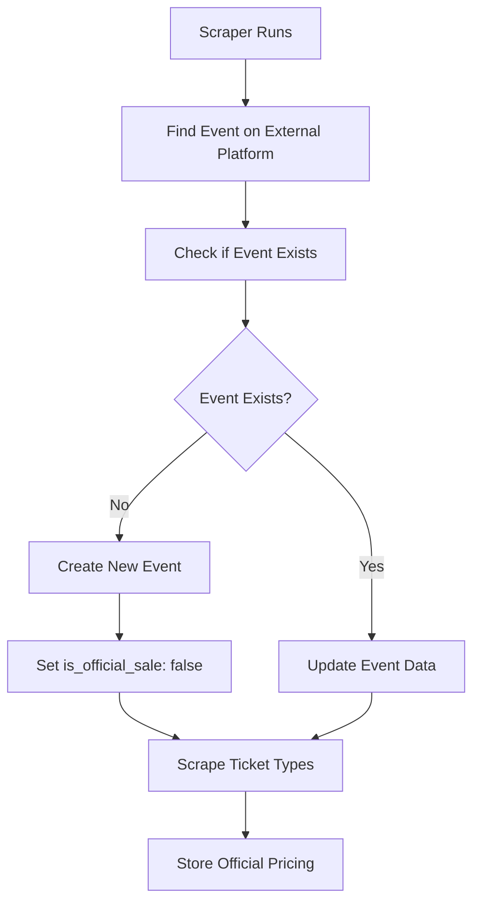
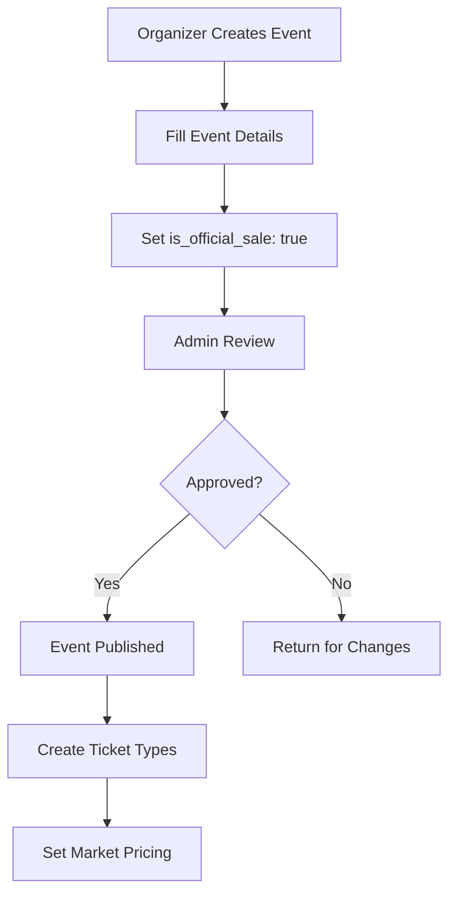

# Event Types and Business Logic

## Overview

The platform supports two main types of events: **reselling events** and **official selling events**. This distinction affects pricing validation, user permissions, and business logic throughout the platform.

## Event Types

### 1. **Reselling Events** (`is_official_sale: false`)

**Description**: Events where tickets are sold through official platforms (AbiTab, RedPagos, etc.) and users can resell their tickets on our platform.

**Characteristics**:
- Tickets originally sold through external platforms
- Users can only resell at or below face value
- Price validation against scraped official data
- Standard platform fees (8%)
- Peer-to-peer transactions

**Examples**:
- Concert tickets from AbiTab
- Sports tickets from RedPagos
- Theater tickets from Antel

### 2. **Official Selling Events** (`is_official_sale: true`)

**Description**: Events where our platform is the official ticket seller, either directly or through partnerships with organizers.

**Characteristics**:
- Our platform is the primary ticket seller
- No face value restrictions (market pricing)
- Direct sales to customers
- Reduced platform fees (5%)
- Official organizer relationships

**Examples**:
- Events created by verified organizers
- Platform-exclusive events
- Partnership events with venues

## Business Logic Differences

### 1. **Pricing Validation**

```typescript
// Price validation service
export class PriceValidationService {
  async validateListingPrice(
    eventId: string,
    ticketType: string,
    proposedPrice: number
  ): Promise<ValidationResult> {
    const event = await this.eventRepo.findById(eventId);
    
    if (event.is_official_sale) {
      // Official selling events: no face value restrictions
      return this.validateOfficialSalePrice(event, proposedPrice);
    } else {
      // Reselling events: must respect face value
      return this.validateResalePrice(event, ticketType, proposedPrice);
    }
  }

  private async validateResalePrice(
    event: Event,
    ticketType: string,
    proposedPrice: number
  ): Promise<ValidationResult> {
    const officialTicketType = await this.officialTicketTypeRepo.findByEventAndType(
      event.id,
      ticketType
    );

    if (!officialTicketType) {
      return {
        valid: false,
        error: 'TICKET_TYPE_NOT_FOUND',
        message: 'Ticket type not found in official data'
      };
    }

    if (proposedPrice > officialTicketType.face_value) {
      return {
        valid: false,
        error: 'PRICE_EXCEEDS_FACE_VALUE',
        message: `Price cannot exceed official face value of ${officialTicketType.face_value} UYU`
      };
    }

    return { valid: true };
  }

  private async validateOfficialSalePrice(
    event: Event,
    proposedPrice: number
  ): Promise<ValidationResult> {
    // For official sales, we can implement market-based pricing
    // This could include competitor analysis, demand forecasting, etc.
    
    // For now, we'll allow any price above a minimum threshold
    const minPrice = 100; // 100 UYU minimum
    
    if (proposedPrice < minPrice) {
      return {
        valid: false,
        error: 'PRICE_BELOW_MINIMUM',
        message: `Price must be at least ${minPrice} UYU`
      };
    }

    return { valid: true };
  }
}
```

### 2. **Platform Fee Structure**

```typescript
// Fee calculation service
export class FeeCalculationService {
  calculatePlatformFee(event: Event, price: number): number {
    if (event.is_official_sale) {
      // Official selling events: 5% fee
      return price * 0.05;
    } else {
      // Reselling events: 8% fee
      return price * 0.08;
    }
  }
}
```

### 3. **User Permissions**

```typescript
// Permission checking
export class EventPermissionService {
  async canCreateEvent(user: User): Promise<boolean> {
    // Only organizers and admins can create official selling events
    return ['organizer', 'admin'].includes(user.role);
  }

  async canCreateOfficialSale(user: User): Promise<boolean> {
    // Additional verification for official sales
    return user.role === 'organizer' && user.status === 'active';
  }
}
```

## Event Creation Workflows

### 1. **Reselling Event Creation** (Automatic)



### 2. **Official Selling Event Creation** (Manual)



## Database Queries

### 1. **Finding Events by Type**

```typescript
// Repository methods
export class EventsRepository {
  // Find reselling events (for users to browse)
  async findResellingEvents(filters: EventFilters): Promise<Event[]> {
    return this.db
      .selectFrom('events')
      .where('is_official_sale', '=', false)
      .where('status', '=', 'published')
      .where('event_date', '>=', new Date())
      .orderBy('event_date', 'asc')
      .execute();
  }

  // Find official selling events (for organizers)
  async findOfficialSaleEvents(organizerId: string): Promise<Event[]> {
    return this.db
      .selectFrom('events')
      .where('is_official_sale', '=', true)
      .where('organizer_id', '=', organizerId)
      .orderBy('created_at', 'desc')
      .execute();
  }

  // Find events for admin dashboard
  async findEventsForAdmin(): Promise<Event[]> {
    return this.db
      .selectFrom('events')
      .orderBy('created_at', 'desc')
      .execute();
  }
}
```

### 2. **Analytics Queries**

```typescript
// Analytics service
export class EventAnalyticsService {
  async getEventTypeStats(): Promise<EventTypeStats> {
    const [resellingCount, officialCount] = await Promise.all([
      this.db
        .selectFrom('events')
        .where('is_official_sale', '=', false)
        .select(this.db.fn.count('id').as('count'))
        .executeTakeFirst(),
      
      this.db
        .selectFrom('events')
        .where('is_official_sale', '=', true)
        .select(this.db.fn.count('id').as('count'))
        .executeTakeFirst()
    ]);

    return {
      resellingEvents: resellingCount?.count || 0,
      officialSaleEvents: officialCount?.count || 0
    };
  }
}
```

## Frontend Implementation

### 1. **Event Display**

```typescript
// Event card component
export const EventCard: React.FC<{ event: Event }> = ({ event }) => {
  return (
    <div className="event-card">
      <h3>{event.name}</h3>
      <p>{event.description}</p>
      
      {/* Show different badges based on event type */}
      {event.is_official_sale ? (
        <span className="badge official">Official Sale</span>
      ) : (
        <span className="badge resale">Resale</span>
      )}
      
      {/* Different CTAs based on event type */}
      {event.is_official_sale ? (
        <button className="btn-primary">Buy Tickets</button>
      ) : (
        <button className="btn-secondary">View Listings</button>
      )}
    </div>
  );
};
```

### 2. **Event Creation Forms**

```typescript
// Event creation form
export const EventCreationForm: React.FC = () => {
  const [isOfficialSale, setIsOfficialSale] = useState(false);
  
  return (
    <form>
      <input name="name" placeholder="Event Name" />
      <textarea name="description" placeholder="Description" />
      
      {/* Only show for organizers */}
      <PermissionGate allowedRoles={['organizer', 'admin']}>
        <div className="form-group">
          <label>
            <input
              type="checkbox"
              checked={isOfficialSale}
              onChange={(e) => setIsOfficialSale(e.target.checked)}
            />
            This is an official selling event
          </label>
          <small>
            Official selling events allow market pricing and have reduced fees.
          </small>
        </div>
      </PermissionGate>
      
      <button type="submit">Create Event</button>
    </form>
  );
};
```

## Future Extensibility

### 1. **Hybrid Events**
- Events that start as official sales but allow reselling
- Dynamic pricing based on demand
- Flexible fee structures

### 2. **Event Partnerships**
- Direct integration with venues
- Automated event creation
- Revenue sharing models

### 3. **Advanced Pricing**
- Dynamic pricing for official sales
- Auction mechanisms
- Bulk pricing for organizers

This event type system provides a solid foundation for both current needs and future growth, allowing the platform to serve both reselling and official selling use cases effectively. 