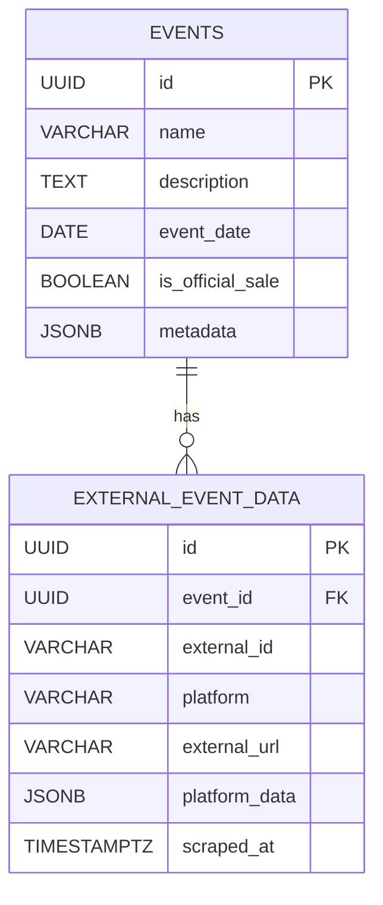

# External Event Data Separation

## Overview

The external event data has been separated into its own table (`EXTERNAL_EVENT_DATA`) to improve database design, reduce complexity, and provide better data organization.

## Problem with Previous Design

### **Issues with External Data in EVENTS Table**
- **Null values**: Official events would have null `external_id`, `platform`, `scraped_at`
- **Mixed concerns**: Core event data mixed with platform-specific data
- **Query complexity**: Need to handle null values in queries
- **Data integrity**: External data not properly normalized

### **Example of Problematic Queries**
```sql
-- Before: Complex queries with null checks
SELECT * FROM events 
WHERE (external_id = '123' AND platform = 'abitab') 
   OR (is_official_sale = true AND external_id IS NULL);

-- Finding scraped events
SELECT * FROM events 
WHERE external_id IS NOT NULL 
  AND platform IS NOT NULL;
```

## New Design Benefits

### 1. **Clean Separation of Concerns**



### 2. **Simplified Event Table**
- **Core event data only**: name, description, date, venue, etc.
- **No null values**: All fields are relevant to all events
- **Clean queries**: No need to handle external data conditions
- **Better performance**: Smaller table, better indexing

### 3. **Flexible External Data**
- **Multiple platforms**: One event can have data from multiple platforms
- **Rich metadata**: `platform_data` JSONB field for platform-specific info
- **External URLs**: Direct links to original event pages
- **Scraping history**: Track when data was last updated

## Implementation Examples

### 1. **Repository Methods**

```typescript
// Events repository - clean and simple
export class EventsRepository {
  async findById(id: string): Promise<Event | null> {
    return this.db
      .selectFrom('events')
      .where('id', '=', id)
      .selectAll()
      .executeTakeFirst();
  }

  async findResellingEvents(): Promise<Event[]> {
    return this.db
      .selectFrom('events')
      .where('is_official_sale', '=', false)
      .where('status', '=', 'published')
      .orderBy('event_date', 'asc')
      .execute();
  }

  async findOfficialSaleEvents(): Promise<Event[]> {
    return this.db
      .selectFrom('events')
      .where('is_official_sale', '=', true)
      .orderBy('created_at', 'desc')
      .execute();
  }
}

// External event data repository
export class ExternalEventDataRepository {
  async findByExternalIdAndPlatform(
    externalId: string, 
    platform: string
  ): Promise<ExternalEventData | null> {
    return this.db
      .selectFrom('external_event_data')
      .where('external_id', '=', externalId)
      .where('platform', '=', platform)
      .selectAll()
      .executeTakeFirst();
  }

  async findByEventId(eventId: string): Promise<ExternalEventData[]> {
    return this.db
      .selectFrom('external_event_data')
      .where('event_id', '=', eventId)
      .selectAll()
      .execute();
  }

  async create(data: CreateExternalEventData): Promise<ExternalEventData> {
    return this.db
      .insertInto('external_event_data')
      .values(data)
      .returningAll()
      .executeTakeFirst();
  }
}
```

### 2. **Service Layer**

```typescript
// Event service with external data
export class EventService {
  constructor(
    private eventRepo: EventsRepository,
    private externalDataRepo: ExternalEventDataRepository
  ) {}

  async getEventWithExternalData(eventId: string): Promise<EventWithExternalData> {
    const [event, externalData] = await Promise.all([
      this.eventRepo.findById(eventId),
      this.externalDataRepo.findByEventId(eventId)
    ]);

    if (!event) {
      throw new Error('Event not found');
    }

    return {
      ...event,
      external_data: externalData
    };
  }

  async findEventByExternalId(externalId: string, platform: string): Promise<Event | null> {
    const externalData = await this.externalDataRepo.findByExternalIdAndPlatform(
      externalId, 
      platform
    );
    
    if (!externalData) {
      return null;
    }
    
    return await this.eventRepo.findById(externalData.event_id);
  }
}
```

### 3. **API Endpoints**

```typescript
// Event controller
export class EventController {
  async getEvent(req: Request, res: Response): Promise<void> {
    const eventId = req.params.id;
    const event = await this.eventService.getEventWithExternalData(eventId);
    
    res.json({
      success: true,
      data: event
    });
  }

  async getResellingEvents(req: Request, res: Response): Promise<void> {
    const events = await this.eventRepo.findResellingEvents();
    
    // Optionally include external data for each event
    const eventsWithExternalData = await Promise.all(
      events.map(async (event) => {
        const externalData = await this.externalDataRepo.findByEventId(event.id);
        return {
          ...event,
          external_data: externalData
        };
      })
    );
    
    res.json({
      success: true,
      data: eventsWithExternalData
    });
  }
}
```

## Query Examples

### 1. **Simple Event Queries**

```sql
-- Find all events (no external data complexity)
SELECT * FROM events WHERE status = 'published';

-- Find official selling events
SELECT * FROM events WHERE is_official_sale = true;

-- Find reselling events
SELECT * FROM events WHERE is_official_sale = false;
```

### 2. **External Data Queries**

```sql
-- Find events from specific platform
SELECT e.* 
FROM events e
JOIN external_event_data eed ON e.id = eed.event_id
WHERE eed.platform = 'abitab';

-- Find events with external URLs
SELECT e.*, eed.external_url
FROM events e
JOIN external_event_data eed ON e.id = eed.event_id
WHERE eed.external_url IS NOT NULL;

-- Find recently scraped events
SELECT e.*, eed.scraped_at
FROM events e
JOIN external_event_data eed ON e.id = eed.event_id
WHERE eed.scraped_at > NOW() - INTERVAL '24 hours';
```

### 3. **Analytics Queries**

```sql
-- Count events by source
SELECT 
  CASE 
    WHEN e.is_official_sale THEN 'official'
    ELSE 'resale'
  END as source,
  COUNT(*) as count
FROM events e
GROUP BY e.is_official_sale;

-- Platform distribution
SELECT 
  eed.platform,
  COUNT(*) as event_count
FROM external_event_data eed
GROUP BY eed.platform
ORDER BY event_count DESC;
```

## Benefits Summary

### 1. **Data Integrity**
- No null values in main event table
- Proper normalization
- Clear relationships

### 2. **Performance**
- Smaller main table
- Better indexing opportunities
- Simpler queries

### 3. **Flexibility**
- Support for multiple platforms per event
- Rich external metadata
- Easy to extend

### 4. **Maintainability**
- Clear separation of concerns
- Easier to understand and modify
- Better code organization

### 5. **Scalability**
- Can handle multiple external platforms
- Easy to add new external data fields
- Better for future features

This separation makes the database design much cleaner and more maintainable while providing better performance and flexibility for future growth. 