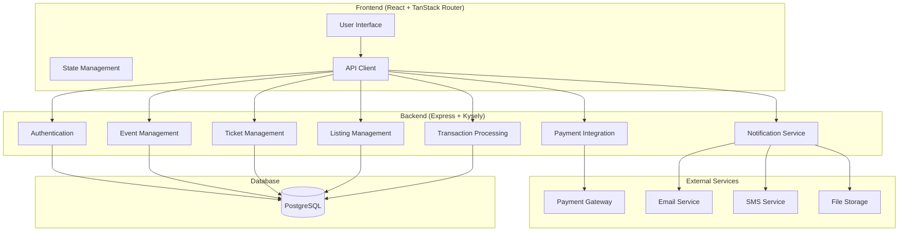
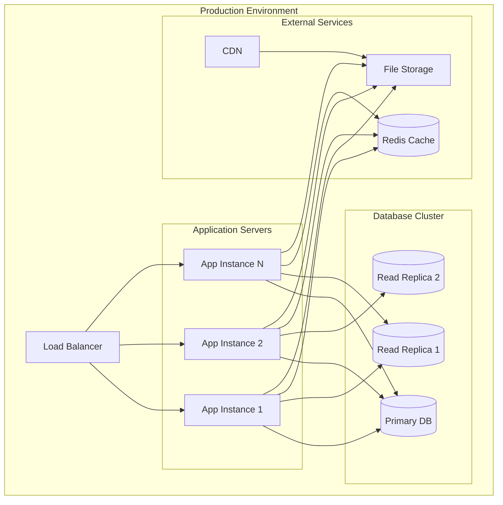

# System Architecture

## Overview

This document outlines the system architecture for the peer-to-peer ticket reselling platform, designed to support both individual resellers and official event organizers.

## High-Level Architecture

## Core Components

### 1. Authentication & Authorization
- **JWT-based authentication**
- **Role-based access control** (buyer, seller, organizer, admin)
- **Session management**
- **OAuth integration** (Google, Facebook for future)

### 2. Event Management
- **Event creation and management**
- **Event validation and approval workflow**
- **Location and venue management**
- **Event categories and tags**

### 3. Ticket Management
- **Ticket creation and validation**
- **Unique ticket codes generation**
- **Ticket metadata handling** (seats, sections, etc.)
- **Ticket transfer mechanisms**

### 4. Listing Management
- **Listing creation and management**
- **Price validation and limits**
- **Listing expiration handling**
- **Listing status management**

### 5. Transaction Processing
- **Escrow system for secure transactions**
- **Payment processing integration**
- **Transaction status tracking**
- **Dispute resolution system**

### 6. Communication System
- **In-app messaging between buyers and sellers**
- **Notification system** (email, SMS, push)
- **Support ticket system**

## Extensibility Considerations

### 1. Official Event Integration
- **Event organizer dashboard**
- **Bulk ticket upload**
- **Official resale program**
- **Revenue sharing models**

### 2. Advanced Features
- **Auction system**
- **Bidding mechanisms**
- **Dynamic pricing**
- **Analytics and reporting**

### 3. Scalability
- **Microservices architecture** (future)
- **Caching strategies** (Redis)
- **CDN for static assets**
- **Load balancing**

## Security Considerations

### 1. Data Protection
- **Encryption at rest and in transit**
- **PCI DSS compliance** for payment data
- **GDPR compliance**
- **Data backup and recovery**

### 2. Fraud Prevention
- **Ticket validation algorithms**
- **User verification systems**
- **Transaction monitoring**
- **Rate limiting**

### 3. API Security
- **Rate limiting**
- **Input validation**
- **SQL injection prevention**
- **CORS configuration**

## Performance Considerations

### 1. Database Optimization
- **Proper indexing strategy**
- **Query optimization**
- **Connection pooling**
- **Read replicas** (future)

### 2. Caching Strategy
- **Redis for session storage**
- **CDN for static assets**
- **Application-level caching**
- **Database query caching**

### 3. Monitoring and Logging
- **Application performance monitoring**
- **Error tracking and alerting**
- **User behavior analytics**
- **Business metrics tracking**

## Deployment Architecture

## Technology Stack

### Frontend
- **React 18** with TypeScript
- **TanStack Router** for routing
- **TanStack Query** for data fetching
- **Tailwind CSS** for styling
- **Vite** for build tooling

### Backend
- **Node.js** with TypeScript
- **Express.js** framework
- **Kysely** for database operations
- **PostgreSQL** database
- **JWT** for authentication

### Infrastructure
- **Docker** for containerization
- **Turborepo** for monorepo management
- **GitHub Actions** for CI/CD
- **Cloud hosting** (AWS/GCP/Azure)

## Future Considerations

### 1. Microservices Migration
- **Event service**
- **Ticket service**
- **Transaction service**
- **Notification service**
- **Payment service**

### 2. Real-time Features
- **WebSocket integration**
- **Real-time messaging**
- **Live auction system**
- **Real-time notifications**

### 3. Mobile Applications
- **React Native** or **Flutter**
- **Progressive Web App (PWA)**
- **Native iOS/Android apps**

### 4. AI/ML Integration
- **Price prediction algorithms**
- **Fraud detection**
- **Recommendation systems**
- **Chatbot support** 