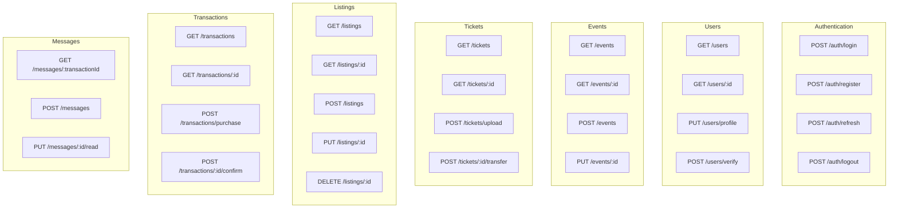

# Technical Implementation Guide

## Overview

This document provides technical guidance for implementing the ticket reselling platform, covering API design, development patterns, and key technical decisions.

## API Design

### 1. RESTful API Structure



### 2. API Response Standards

```typescript
// Standard API Response Format
interface ApiResponse<T> {
  success: boolean;
  data?: T;
  error?: {
    code: string;
    message: string;
    details?: any;
  };
  meta?: {
    pagination?: {
      page: number;
      limit: number;
      total: number;
      totalPages: number;
    };
    timestamp: string;
  };
}

// Example Response
{
  "success": true,
  "data": {
    "id": 1,
    "name": "Concert Event",
    "event_date": "2024-06-15",
    "location": "Madison Square Garden"
  },
  "meta": {
    "timestamp": "2024-01-15T10:30:00Z"
  }
}
```

### 3. Error Handling

```typescript
// Error Codes
enum ErrorCodes {
  // Authentication
  UNAUTHORIZED = 'UNAUTHORIZED',
  INVALID_CREDENTIALS = 'INVALID_CREDENTIALS',
  TOKEN_EXPIRED = 'TOKEN_EXPIRED',
  
  // Validation
  VALIDATION_ERROR = 'VALIDATION_ERROR',
  INVALID_INPUT = 'INVALID_INPUT',
  
  // Business Logic
  INSUFFICIENT_FUNDS = 'INSUFFICIENT_FUNDS',
  TICKET_NOT_AVAILABLE = 'TICKET_NOT_AVAILABLE',
  LISTING_EXPIRED = 'LISTING_EXPIRED',
  
  // System
  INTERNAL_ERROR = 'INTERNAL_ERROR',
  SERVICE_UNAVAILABLE = 'SERVICE_UNAVAILABLE'
}

// Error Response Example
{
  "success": false,
  "error": {
    "code": "VALIDATION_ERROR",
    "message": "Price exceeds maximum allowed markup",
    "details": {
      "field": "price",
      "maxAllowed": 120,
      "provided": 150
    }
  }
}
```

## Database Implementation

### 1. Kysely Schema Definition

```typescript
// Database schema using Kysely
export interface Database {
  users: UsersTable;
  events: EventsTable;
  tickets: TicketsTable;
  listings: ListingsTable;
  transactions: TransactionsTable;
  messages: MessagesTable;
  notifications: NotificationsTable;
  disputes: DisputesTable;
  audit_logs: AuditLogsTable;
}

export interface UsersTable {
  id: Generated<number>;
  name: string;
  email: string;
  phone: string | null;
  role: 'user' | 'organizer' | 'admin';
  status: 'active' | 'suspended' | 'banned' | 'pending_verification';
  email_verified: boolean;
  phone_verified: boolean;
  avatar_url: string | null;
  preferences: JsonValue;
  created_at: Generated<Timestamp>;
  updated_at: Generated<Timestamp>;
  last_login_at: Timestamp | null;
}

export interface EventsTable {
  id: Generated<number>;
  name: string;
  description: string | null;
  event_date: Date;
  event_time: string | null;
  location: string;
  venue_name: string | null;
  city: string | null;
  country: string | null;
  postal_code: string | null;
  latitude: Decimal | null;
  longitude: Decimal | null;
  organizer_id: number;
  status: 'draft' | 'published' | 'cancelled' | 'completed';
  category: string;
  metadata: JsonValue;
  image_url: string | null;
  created_at: Generated<Timestamp>;
  updated_at: Generated<Timestamp>;
}
```

### 2. Repository Pattern

```typescript
// Base Repository
export abstract class BaseRepository<T> {
  constructor(protected db: Kysely<Database>) {}

  async findById(id: number): Promise<T | null> {
    // Implementation
  }

  async create(data: Omit<T, 'id' | 'created_at' | 'updated_at'>): Promise<T> {
    // Implementation
  }

  async update(id: number, data: Partial<T>): Promise<T | null> {
    // Implementation
  }

  async delete(id: number): Promise<boolean> {
    // Implementation
  }
}

// Specific Repository
export class UsersRepository extends BaseRepository<User> {
  async findByEmail(email: string): Promise<User | null> {
    return this.db
      .selectFrom('users')
      .where('email', '=', email)
      .selectAll()
      .executeTakeFirst();
  }

  async updateLastLogin(id: number): Promise<void> {
    await this.db
      .updateTable('users')
      .set({ last_login_at: new Date() })
      .where('id', '=', id)
      .execute();
  }
}
```

## Service Layer

### 1. Business Logic Services

```typescript
// Transaction Service
export class TransactionService {
  constructor(
    private transactionRepo: TransactionsRepository,
    private listingRepo: ListingsRepository,
    private ticketRepo: TicketsRepository,
    private paymentService: PaymentService,
    private notificationService: NotificationService
  ) {}

  async initiatePurchase(
    listingId: number,
    buyerId: number,
    paymentMethod: PaymentMethod
  ): Promise<Transaction> {
    // 1. Validate listing availability
    const listing = await this.listingRepo.findById(listingId);
    if (!listing || listing.status !== 'active') {
      throw new BusinessError('LISTING_NOT_AVAILABLE');
    }

    // 2. Process payment
    const payment = await this.paymentService.processPayment({
      amount: listing.price,
      buyerId,
      paymentMethod,
      description: `Purchase of ticket ${listing.ticket_id}`
    });

    // 3. Create transaction record
    const transaction = await this.transactionRepo.create({
      listing_id: listingId,
      buyer_id: buyerId,
      seller_id: listing.seller_id,
      final_price: listing.price,
      platform_fee: this.calculatePlatformFee(listing.price),
      payment_status: 'pending',
      payment_method: paymentMethod,
      payment_gateway: payment.gateway,
      payment_id: payment.id
    });

    // 4. Update listing status
    await this.listingRepo.update(listingId, { status: 'pending' });

    // 5. Send notifications
    await this.notificationService.notifySeller(listing.seller_id, {
      type: 'purchase_initiated',
      transactionId: transaction.id
    });

    return transaction;
  }

  private calculatePlatformFee(price: number): number {
    // Platform fee calculation logic
    return price * 0.08; // 8% fee
  }
}
```

### 2. Validation Services

```typescript
// Pricing Validation Service
export class PricingValidationService {
  async validateListingPrice(
    ticketId: number,
    price: number,
    sellerId: number
  ): Promise<ValidationResult> {
    const ticket = await this.ticketRepo.findById(ticketId);
    const event = await this.eventRepo.findById(ticket.event_id);
    
    // Check maximum markup
    const maxMarkup = this.getMaxMarkupForCategory(event.category);
    const maxPrice = ticket.face_value * (1 + maxMarkup);
    
    if (price > maxPrice) {
      return {
        valid: false,
        error: 'PRICE_EXCEEDS_MAX_MARKUP',
        details: {
          maxAllowed: maxPrice,
          provided: price,
          markup: maxMarkup
        }
      };
    }

    // Check minimum price
    const minPrice = ticket.face_value * 0.8; // 20% below face value
    if (price < minPrice) {
      return {
        valid: false,
        error: 'PRICE_BELOW_MINIMUM',
        details: {
          minAllowed: minPrice,
          provided: price
        }
      };
    }

    return { valid: true };
  }

  private getMaxMarkupForCategory(category: string): number {
    const markups = {
      concert: 0.20,
      sports: 0.15,
      theater: 0.25,
      festival: 0.30
    };
    return markups[category] || 0.20;
  }
}
```

## Security Implementation

### 1. Authentication Middleware

```typescript
// JWT Authentication Middleware
export const authenticateToken = async (
  req: Request,
  res: Response,
  next: NextFunction
): Promise<void> => {
  const authHeader = req.headers.authorization;
  const token = authHeader && authHeader.split(' ')[1];

  if (!token) {
    res.status(401).json({
      success: false,
      error: {
        code: 'UNAUTHORIZED',
        message: 'Access token required'
      }
    });
    return;
  }

  try {
    const decoded = jwt.verify(token, process.env.JWT_SECRET!) as JwtPayload;
    const user = await userRepo.findById(decoded.userId);
    
    if (!user || user.status !== 'active') {
      res.status(401).json({
        success: false,
        error: {
          code: 'UNAUTHORIZED',
          message: 'Invalid or inactive user'
        }
      });
      return;
    }

    req.user = user;
    next();
  } catch (error) {
    res.status(401).json({
      success: false,
      error: {
        code: 'TOKEN_EXPIRED',
        message: 'Invalid or expired token'
      }
    });
  }
};
```

### 2. Rate Limiting

```typescript
// Rate Limiting Middleware
import rateLimit from 'express-rate-limit';

export const createRateLimiter = (options: {
  windowMs: number;
  max: number;
  message?: string;
}) => {
  return rateLimit({
    windowMs: options.windowMs,
    max: options.max,
    message: {
      success: false,
      error: {
        code: 'RATE_LIMIT_EXCEEDED',
        message: options.message || 'Too many requests'
      }
    },
    standardHeaders: true,
    legacyHeaders: false
  });
};

// Apply different limits for different endpoints
export const authLimiter = createRateLimiter({
  windowMs: 15 * 60 * 1000, // 15 minutes
  max: 5, // 5 attempts
  message: 'Too many login attempts'
});

export const apiLimiter = createRateLimiter({
  windowMs: 15 * 60 * 1000, // 15 minutes
  max: 100 // 100 requests
});
```

## Testing Strategy

### 1. Unit Tests

```typescript
// Service Unit Tests
describe('TransactionService', () => {
  let transactionService: TransactionService;
  let mockTransactionRepo: jest.Mocked<TransactionsRepository>;
  let mockPaymentService: jest.Mocked<PaymentService>;

  beforeEach(() => {
    mockTransactionRepo = createMockTransactionsRepository();
    mockPaymentService = createMockPaymentService();
    
    transactionService = new TransactionService(
      mockTransactionRepo,
      mockListingRepo,
      mockTicketRepo,
      mockPaymentService,
      mockNotificationService
    );
  });

  describe('initiatePurchase', () => {
    it('should create transaction when listing is available', async () => {
      // Arrange
      const listingId = 1;
      const buyerId = 2;
      const paymentMethod = 'credit_card';
      
      mockListingRepo.findById.mockResolvedValue({
        id: listingId,
        status: 'active',
        price: 100,
        seller_id: 3
      } as Listing);
      
      mockPaymentService.processPayment.mockResolvedValue({
        id: 'pay_123',
        gateway: 'stripe',
        status: 'succeeded'
      });

      // Act
      const result = await transactionService.initiatePurchase(
        listingId,
        buyerId,
        paymentMethod
      );

      // Assert
      expect(mockTransactionRepo.create).toHaveBeenCalledWith(
        expect.objectContaining({
          listing_id: listingId,
          buyer_id: buyerId,
          final_price: 100
        })
      );
      expect(result).toBeDefined();
    });

    it('should throw error when listing is not available', async () => {
      // Arrange
      mockListingRepo.findById.mockResolvedValue(null);

      // Act & Assert
      await expect(
        transactionService.initiatePurchase(1, 2, 'credit_card')
      ).rejects.toThrow('LISTING_NOT_AVAILABLE');
    });
  });
});
```

### 2. Integration Tests

```typescript
// API Integration Tests
describe('Transaction API', () => {
  let app: Express;
  let authToken: string;

  beforeAll(async () => {
    app = createTestApp();
    authToken = await createTestUser();
  });

  describe('POST /transactions/purchase', () => {
    it('should create transaction successfully', async () => {
      // Arrange
      const purchaseData = {
        listingId: 1,
        paymentMethod: 'credit_card'
      };

      // Act
      const response = await request(app)
        .post('/transactions/purchase')
        .set('Authorization', `Bearer ${authToken}`)
        .send(purchaseData);

      // Assert
      expect(response.status).toBe(201);
      expect(response.body.success).toBe(true);
      expect(response.body.data).toHaveProperty('id');
      expect(response.body.data.payment_status).toBe('pending');
    });
  });
});
```

## Performance Optimization

### 1. Database Query Optimization

```typescript
// Optimized Queries with Kysely
export class OptimizedListingsRepository {
  async findActiveListingsWithDetails(filters: ListingFilters) {
    return this.db
      .selectFrom('listings as l')
      .innerJoin('tickets as t', 'l.ticket_id', 't.id')
      .innerJoin('events as e', 't.event_id', 'e.id')
      .innerJoin('users as s', 'l.seller_id', 's.id')
      .where('l.status', '=', 'active')
      .where('l.expires_at', '>', new Date())
      .select([
        'l.id',
        'l.price',
        'l.listed_at',
        't.ticket_type',
        't.face_value',
        'e.name as event_name',
        'e.event_date',
        'e.location',
        's.name as seller_name',
        's.email_verified'
      ])
      .orderBy('l.listed_at', 'desc')
      .limit(filters.limit || 20)
      .offset(filters.offset || 0)
      .execute();
  }
}
```

### 2. Caching Strategy

```typescript
// Redis Caching Service
export class CacheService {
  constructor(private redis: Redis) {}

  async get<T>(key: string): Promise<T | null> {
    const data = await this.redis.get(key);
    return data ? JSON.parse(data) : null;
  }

  async set(key: string, value: any, ttl?: number): Promise<void> {
    const serialized = JSON.stringify(value);
    if (ttl) {
      await this.redis.setex(key, ttl, serialized);
    } else {
      await this.redis.set(key, serialized);
    }
  }

  async invalidate(pattern: string): Promise<void> {
    const keys = await this.redis.keys(pattern);
    if (keys.length > 0) {
      await this.redis.del(...keys);
    }
  }
}

// Cached Service
export class CachedEventsService {
  constructor(
    private eventsRepo: EventsRepository,
    private cache: CacheService
  ) {}

  async findUpcomingEvents(): Promise<Event[]> {
    const cacheKey = 'events:upcoming';
    let events = await this.cache.get<Event[]>(cacheKey);
    
    if (!events) {
      events = await this.eventsRepo.findUpcoming();
      await this.cache.set(cacheKey, events, 300); // 5 minutes
    }
    
    return events;
  }
}
```

## Deployment Considerations

### 1. Environment Configuration

```typescript
// Environment Configuration
export const config = {
  database: {
    host: process.env.DB_HOST || 'localhost',
    port: parseInt(process.env.DB_PORT || '5432'),
    database: process.env.DB_NAME || 'ticket_platform',
    username: process.env.DB_USER || 'postgres',
    password: process.env.DB_PASSWORD || '',
    ssl: process.env.NODE_ENV === 'production'
  },
  
  jwt: {
    secret: process.env.JWT_SECRET!,
    expiresIn: process.env.JWT_EXPIRES_IN || '24h'
  },
  
  payment: {
    stripe: {
      secretKey: process.env.STRIPE_SECRET_KEY!,
      webhookSecret: process.env.STRIPE_WEBHOOK_SECRET!
    }
  },
  
  redis: {
    host: process.env.REDIS_HOST || 'localhost',
    port: parseInt(process.env.REDIS_PORT || '6379'),
    password: process.env.REDIS_PASSWORD
  },
  
  email: {
    provider: process.env.EMAIL_PROVIDER || 'sendgrid',
    apiKey: process.env.EMAIL_API_KEY!
  }
};
```

### 2. Health Checks

```typescript
// Health Check Endpoints
export const healthCheckRouter = Router();

healthCheckRouter.get('/health', async (req, res) => {
  try {
    // Database health check
    await db.selectFrom('users').select('id').limit(1).execute();
    
    // Redis health check
    await redis.ping();
    
    res.json({
      status: 'healthy',
      timestamp: new Date().toISOString(),
      services: {
        database: 'connected',
        redis: 'connected',
        payment: 'connected'
      }
    });
  } catch (error) {
    res.status(503).json({
      status: 'unhealthy',
      timestamp: new Date().toISOString(),
      error: error.message
    });
  }
});
```

This technical implementation guide provides a solid foundation for building your ticket reselling platform with proper architecture, security, and scalability considerations. 