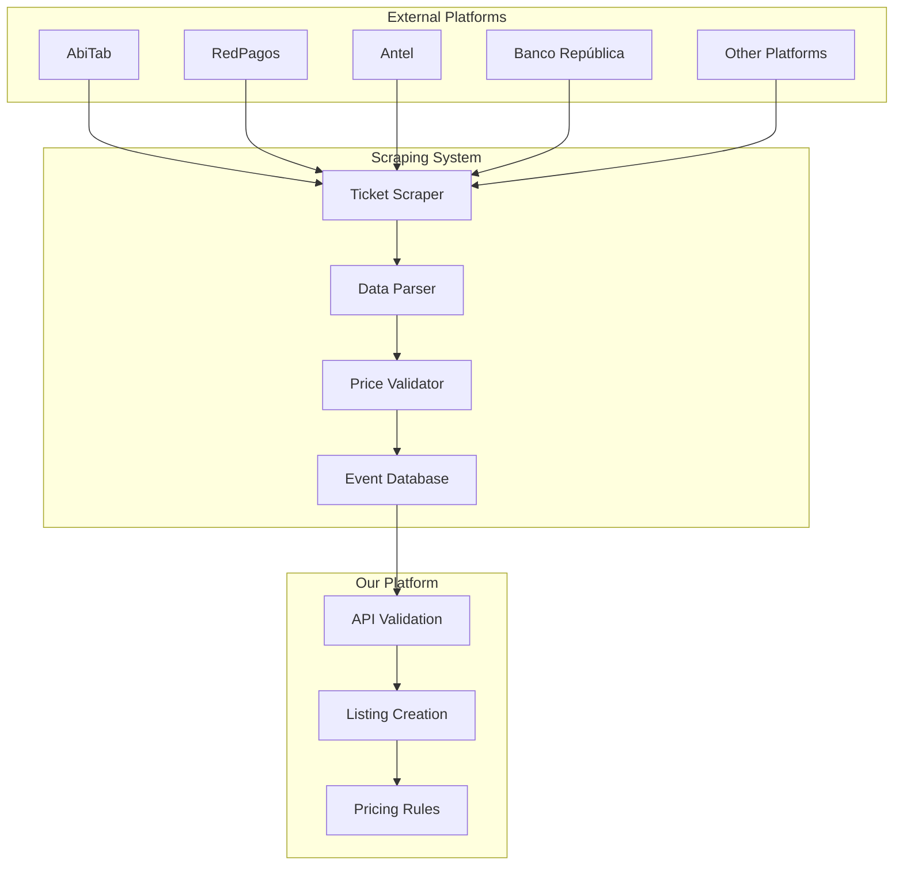

# Ticket Scraping and Pricing Validation

## Overview

This document outlines the ticket scraping system that monitors Uruguayan ticket platforms to ensure fair pricing and prevent price gouging on our reselling platform.

## System Architecture



## Target Platforms

### 1. **Primary Uruguayan Ticket Platforms**
- **Entraste**: Major ticket distributor
- **Passline**: Popular ticketing platform
- **RedTickets**: Event ticketing service
- **Local venues**: Direct sales

### 2. **Data to Scrape**
- Event information (name, date, venue, description)
- Ticket types (general, VIP, early bird, etc.)
- Face values for each ticket type
- Availability status
- Event categories

## Database Schema for Scraped Data

```mermaid
erDiagram
    EVENTS {
      UUID      id PK
      VARCHAR   name
      TEXT      description
      DATE      event_date
      TIME      event_time
      VARCHAR   venue_name
      VARCHAR   venue_address
      VARCHAR   city
      VARCHAR   category
      BOOLEAN   is_official_sale DEFAULT FALSE "Official selling event vs reselling event"
      JSONB     metadata        "event-specific data"
      TIMESTAMPTZ created_at
      TIMESTAMPTZ updated_at
    }

    EXTERNAL_EVENT_DATA {
      UUID      id PK
      UUID      event_id FK      "→ EVENTS.id"
      VARCHAR   external_id      "ID from source platform"
      VARCHAR   platform         "abitab, redpagos, antel, etc."
      VARCHAR   external_url     "Direct link to event on platform"
      JSONB     platform_data    "Platform-specific data"
      TIMESTAMPTZ scraped_at     "Last time data was scraped"
      TIMESTAMPTZ created_at
      TIMESTAMPTZ updated_at
    }

    OFFICIAL_TICKET_TYPES {
      UUID      id PK
      UUID      event_id FK      "→ EVENTS.id"
      VARCHAR   ticket_type      "general, vip, early_bird, etc."
      NUMERIC   face_value
      VARCHAR   currency DEFAULT 'UYU'
      VARCHAR   status           "available, sold_out, coming_soon"
      JSONB     metadata         "seat info, restrictions, etc."
      TIMESTAMPTZ scraped_at
      TIMESTAMPTZ created_at
      TIMESTAMPTZ updated_at
    }
```

## Scraping Implementation

### 1. **Scraping Service**

```typescript
// Scraping service interface
export interface ScrapingService {
  scrapeEvents(): Promise<ScrapedEventData[]>;
  scrapeTicketTypes(eventId: string): Promise<OfficialTicketType[]>;
  getPlatformName(): string;
}

// Entraste scraper implementation
export class EntrasteScraper implements ScrapingService {
  async scrapeEvents(): Promise<ScrapedEventData[]> {
    const events: ScrapedEventData[] = [];
    
    // Implementation for Entraste
    const response = await fetch('https://entraste.com.uy/eventos');
    const html = await response.text();
    
    // Parse HTML and extract events
    const eventElements = this.parseEventElements(html);
    
    for (const element of eventElements) {
      events.push({
        external_id: element.id,
        platform: 'entraste',
        name: element.name,
        description: element.description,
        event_date: element.date,
        event_time: element.time,
        venue_name: element.venue,
        venue_address: element.address,
        city: element.city,
        category: element.category,
        metadata: element.additionalData
      });
    }
    
    return events;
  }
  
  async scrapeTicketTypes(eventId: string): Promise<OfficialTicketType[]> {
    // Implementation for scraping ticket types
  }
  
  getPlatformName(): string {
    return 'entraste';
  }
}
```

### 2. **Data Processing Pipeline**

```typescript
// Data processing service
export class TicketDataProcessor {
  constructor(
    private scrapers: ScrapingService[],
    private eventRepo: EventsRepository,
    private ticketTypeRepo: OfficialTicketTypesRepository
  ) {}

  async processAllPlatforms(): Promise<void> {
    for (const scraper of this.scrapers) {
      try {
        await this.processPlatform(scraper);
      } catch (error) {
        console.error(`Error processing ${scraper.getPlatformName()}:`, error);
      }
    }
  }

  private async processPlatform(scraper: ScrapingService): Promise<void> {
    // 1. Scrape events
    const scrapedEvents = await scraper.scrapeEvents();
    
    // 2. Process each event
    for (const scrapedEvent of scrapedEvents) {
      await this.processEvent(scrapedEvent, scraper);
    }
  }

  private async processEvent(scrapedEvent: ScrapedEventData, scraper: ScrapingService): Promise<void> {
    // 1. Find existing event by external data
    let event = await this.findEventByExternalData(
      scrapedEvent.external_id, 
      scrapedEvent.platform
    );
    
    if (!event) {
      // Create new event
      event = await this.eventRepo.create({
        name: scrapedEvent.name,
        description: scrapedEvent.description,
        event_date: scrapedEvent.event_date,
        event_time: scrapedEvent.event_time,
        venue_name: scrapedEvent.venue_name,
        venue_address: scrapedEvent.venue_address,
        city: scrapedEvent.city,
        category: scrapedEvent.category,
        is_official_sale: false, // Scraped events are for reselling
        metadata: scrapedEvent.metadata
      });

      // Create external event data
      await this.externalEventDataRepo.create({
        event_id: event.id,
        external_id: scrapedEvent.external_id,
        platform: scrapedEvent.platform,
        external_url: scrapedEvent.external_url,
        platform_data: scrapedEvent.platform_data,
        scraped_at: new Date()
      });
    } else {
      // Update existing event
      await this.eventRepo.update(event.id, {
        name: scrapedEvent.name,
        description: scrapedEvent.description,
        event_date: scrapedEvent.event_date,
        event_time: scrapedEvent.event_time,
        venue_name: scrapedEvent.venue_name,
        venue_address: scrapedEvent.venue_address,
        city: scrapedEvent.city,
        category: scrapedEvent.category,
        metadata: scrapedEvent.metadata
      });

      // Update external event data
      await this.externalEventDataRepo.updateByEventId(event.id, {
        external_url: scrapedEvent.external_url,
        platform_data: scrapedEvent.platform_data,
        scraped_at: new Date()
      });
    }
    
    // 2. Scrape and update ticket types
    const ticketTypes = await scraper.scrapeTicketTypes(scrapedEvent.external_id);
    
    // 3. Update ticket types
    for (const ticketType of ticketTypes) {
      ticketType.event_id = event.id;
      await this.ticketTypeRepo.upsert(ticketType);
    }
  }

  private async findEventByExternalData(externalId: string, platform: string): Promise<Event | null> {
    const externalData = await this.externalEventDataRepo.findByExternalIdAndPlatform(
      externalId, 
      platform
    );
    
    if (!externalData) {
      return null;
    }
    
    return await this.eventRepo.findById(externalData.event_id);
  }
}
```

## Pricing Validation System

### 1. **Price Validation Logic**

```typescript
// Price validation service
export class PriceValidationService {
  constructor(
    private officialTicketTypeRepo: OfficialTicketTypesRepository,
    private eventRepo: EventsRepository
  ) {}

  async validateListingPrice(
    eventId: string,
    ticketType: string,
    proposedPrice: number
  ): Promise<ValidationResult> {
    // 1. Get the event
    const event = await this.eventRepo.findById(eventId);
    if (!event) {
      return {
        valid: false,
        error: 'EVENT_NOT_FOUND',
        message: 'Event not found'
      };
    }

    // 2. Get official ticket type data
    const officialTicketType = await this.officialTicketTypeRepo.findByEventAndType(
      eventId,
      ticketType
    );

    if (!officialTicketType) {
      return {
        valid: false,
        error: 'TICKET_TYPE_NOT_FOUND',
        message: 'Ticket type not found in official data'
      };
    }

    // 3. Validate price
    if (proposedPrice > officialTicketType.face_value) {
      return {
        valid: false,
        error: 'PRICE_EXCEEDS_FACE_VALUE',
        message: `Price cannot exceed official face value of ${officialTicketType.face_value} UYU`,
        details: {
          proposedPrice,
          faceValue: officialTicketType.face_value,
          maxAllowed: officialTicketType.face_value
        }
      };
    }

    return { valid: true };
  }
}
```

### 2. **Listing Creation with Validation**

```typescript
// Enhanced listing service
export class ListingService {
  constructor(
    private priceValidator: PriceValidationService,
    private listingRepo: ListingsRepository
  ) {}

  async createListing(listingData: CreateListingRequest): Promise<Listing> {
    // 1. Validate price against scraped data
    const validation = await this.priceValidator.validateListingPrice(
      listingData.eventId,
      listingData.ticketType,
      listingData.price
    );

    if (!validation.valid) {
      throw new BusinessError(validation.error, validation.message, validation.details);
    }

    // 2. Create listing
    const listing = await this.listingRepo.create({
      ticket_id: listingData.ticketId,
      seller_id: listingData.sellerId,
      price: listingData.price,
      original_price: listingData.price,
      status: 'active',
      listing_type: 'fixed_price',
      description: listingData.description,
      terms: listingData.terms,
      listed_at: new Date(),
      expires_at: this.calculateExpiryDate()
    });

    return listing;
  }
}
```

## Event Matching System

### 1. **Automatic Matching**

```typescript
// Event matching service
export class EventMatchingService {
  async findMatchingEvent(scrapedEvent: ScrapedEvent): Promise<Event | null> {
    // 1. Try exact name match
    let event = await this.eventRepo.findByName(scrapedEvent.name);
    if (event) {
      return event;
    }

    // 2. Try fuzzy matching
    const fuzzyMatches = await this.findFuzzyMatches(scrapedEvent);
    if (fuzzyMatches.length > 0) {
      // Return the best match
      return fuzzyMatches[0];
    }

    // 3. Try date and venue matching
    const dateVenueMatches = await this.findDateVenueMatches(scrapedEvent);
    if (dateVenueMatches.length > 0) {
      return dateVenueMatches[0];
    }

    return null;
  }

  private async findFuzzyMatches(scrapedEvent: ScrapedEvent): Promise<Event[]> {
    // Implementation using string similarity algorithms
    // Consider using libraries like 'string-similarity' or 'fuse.js'
  }
}
```

### 2. **Manual Matching Interface**

```typescript
// Admin interface for manual matching
export class EventMatchingController {
  async getUnmatchedEvents(req: Request, res: Response): Promise<void> {
    const unmatched = await this.scrapedEventRepo.findUnmatched();
    
    res.json({
      success: true,
      data: unmatched,
      meta: {
        total: unmatched.length
      }
    });
  }

  async createManualMatch(req: Request, res: Response): Promise<void> {
    const { scrapedEventId, ourEventId, confidenceScore } = req.body;
    
    const matching = await this.eventMatchingRepo.create({
      scraped_event_id: scrapedEventId,
      our_event_id: ourEventId,
      confidence_score: confidenceScore,
      match_type: 'manual',
      matched_by: req.user.id
    });

    res.json({
      success: true,
      data: matching
    });
  }
}
```

## Scheduling and Monitoring

### 1. **Scraping Schedule**

```typescript
// Cron job configuration
export const scrapingSchedule = {
  // Scrape every 2 hours during business hours
  events: '0 */2 8-20 * * *',
  
  // Scrape ticket availability every hour
  availability: '0 * 8-20 * * *',
  
  // Full refresh every day at 2 AM
  fullRefresh: '0 0 2 * * *'
};

// Scraping job
export class ScrapingJob {
  async run(): Promise<void> {
    console.log('Starting scheduled scraping job');
    
    const processor = new TicketDataProcessor(
      [new EntrasteScraper(), new PasslineScraper(), new RedTicketsScraper()],
      this.eventRepo,
      this.ticketTypeRepo
    );
    
    await processor.processAllPlatforms();
    
    console.log('Scraping job completed');
  }
}
```

### 2. **Monitoring and Alerts**

```typescript
// Monitoring service
export class ScrapingMonitor {
  async checkScrapingHealth(): Promise<HealthStatus> {
    const lastScrape = await this.getLastScrapeTime();
    const timeSinceLastScrape = Date.now() - lastScrape.getTime();
    
    if (timeSinceLastScrape > 4 * 60 * 60 * 1000) { // 4 hours
      await this.sendAlert('Scraping job may have failed');
      return { status: 'unhealthy', lastScrape };
    }
    
    return { status: 'healthy', lastScrape };
  }

  async sendAlert(message: string): Promise<void> {
    // Send notification to admin team
  }
}
```

## Benefits of This System

### 1. **Fair Pricing**
- Prevents price gouging
- Ensures users can't sell above face value
- Maintains platform credibility

### 2. **Data Accuracy**
- Real-time ticket information
- Accurate pricing data
- Event availability tracking

### 3. **User Trust**
- Transparent pricing validation
- Clear error messages
- Reliable ticket information

### 4. **Compliance**
- Adheres to Uruguayan regulations
- Prevents illegal resale practices
- Maintains platform integrity

## Implementation Considerations

### 1. **Legal Compliance**
- Respect robots.txt files
- Implement rate limiting
- Monitor for legal changes

### 2. **Technical Robustness**
- Handle scraping failures gracefully
- Implement retry mechanisms
- Monitor scraping performance

### 3. **Data Quality**
- Validate scraped data
- Handle data inconsistencies
- Implement data cleaning processes

This system ensures your platform maintains fair pricing while providing accurate, up-to-date ticket information from official Uruguayan sources. 