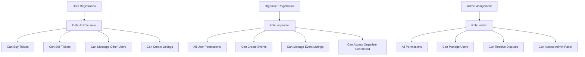
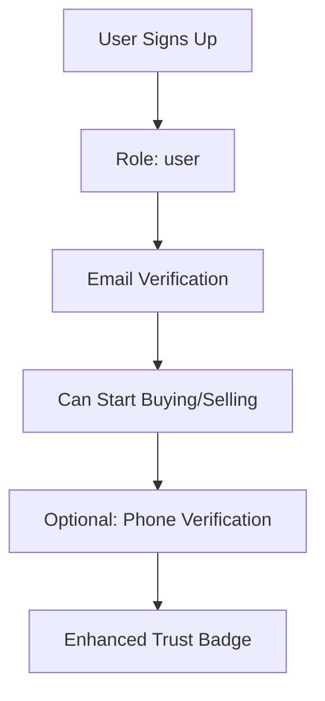
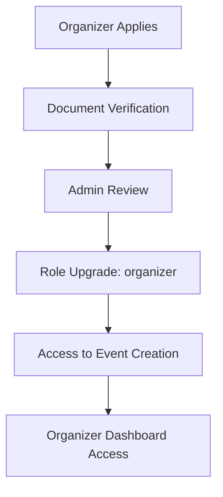
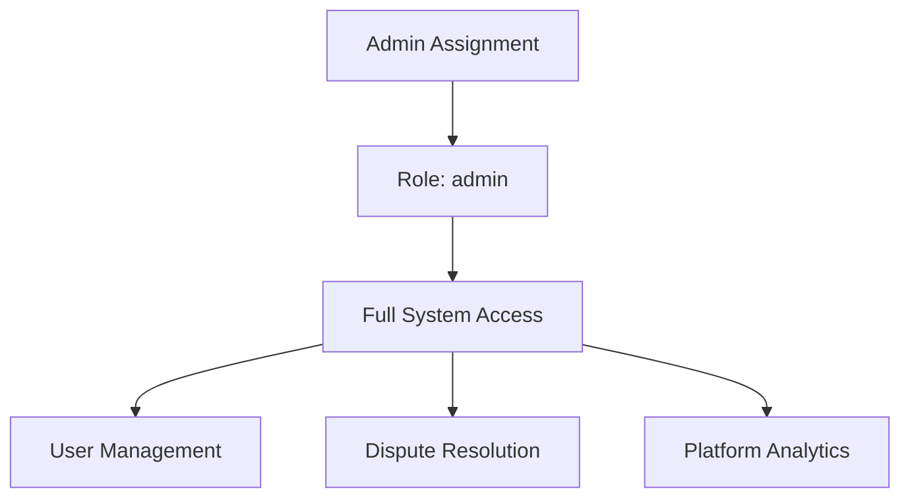

# User Roles and Permissions

## Overview

In a peer-to-peer ticket reselling platform, users should be able to both buy and sell tickets naturally. The role system is designed to reflect the platform's collaborative nature rather than limiting users to specific transactional roles.

## Role System Design

### 1. **User Roles**



### 2. **Role Definitions**

#### **User (Default Role)**

- **Description**: Standard platform user who can both buy and sell tickets
- **Permissions**:
  - Browse and search events
  - Create ticket listings
  - Purchase tickets from other users
  - Message buyers/sellers
  - Manage their own listings
  - View transaction history
  - Update profile and preferences
  - Report issues or disputes

#### **Organizer**

- **Description**: Event organizers who can create and manage events
- **Permissions**:
  - All user permissions
  - Create and manage events
  - Upload official tickets
  - Access organizer dashboard
  - View event-specific analytics
  - Manage official resale programs
  - Set event-specific pricing rules

#### **Admin**

- **Description**: Platform administrators with full system access
- **Permissions**:
  - All organizer permissions
  - Manage user accounts (suspend, ban, verify)
  - Resolve disputes
  - Access admin dashboard
  - View platform analytics
  - Manage pricing rules
  - System configuration

## Permission Matrix

| Action                  | User | Organizer | Admin |
| ----------------------- | ---- | --------- | ----- |
| Browse events           | ✅   | ✅        | ✅    |
| Create listings         | ✅   | ✅        | ✅    |
| Purchase tickets        | ✅   | ✅        | ✅    |
| Send messages           | ✅   | ✅        | ✅    |
| Create events           | ❌   | ✅        | ✅    |
| Manage events           | ❌   | ✅        | ✅    |
| Upload official tickets | ❌   | ✅        | ✅    |
| Suspend users           | ❌   | ❌        | ✅    |
| Resolve disputes        | ❌   | ❌        | ✅    |
| Access admin panel      | ❌   | ❌        | ✅    |

## Implementation Strategy

### 1. **Role-Based Access Control (RBAC)**

```typescript
// Permission checking middleware
export const requireRole = (allowedRoles: UserRole[]) => {
  return (req: Request, res: Response, next: NextFunction) => {
    const user = req.user;

    if (!user || !allowedRoles.includes(user.role)) {
      return res.status(403).json({
        success: false,
        error: {
          code: 'INSUFFICIENT_PERMISSIONS',
          message: 'You do not have permission to perform this action',
        },
      });
    }

    next();
  };
};

// Usage examples
router.post('/events', requireRole(['organizer', 'admin']), createEvent);
router.get('/admin/users', requireRole(['admin']), getUsers);
```

### 2. **Feature Flags Based on Role**

```typescript
// Frontend permission checking
export const usePermissions = () => {
  const {user} = useAuth();

  return {
    canCreateEvents: ['organizer', 'admin'].includes(user?.role || ''),
    canAccessAdmin: user?.role === 'admin',
    canManageEvents: ['organizer', 'admin'].includes(user?.role || ''),
    canResolveDisputes: user?.role === 'admin',
    canSuspendUsers: user?.role === 'admin',
  };
};
```

### 3. **UI Component Permissions**

```typescript
// Permission-based component rendering
export const PermissionGate: React.FC<{
  allowedRoles: UserRole[];
  children: React.ReactNode;
  fallback?: React.ReactNode;
}> = ({allowedRoles, children, fallback}) => {
  const {user} = useAuth();

  if (!user || !allowedRoles.includes(user.role)) {
    return fallback || null;
  }

  return <>{children}</>;
};

// Usage
<PermissionGate allowedRoles={['organizer', 'admin']}>
  <CreateEventButton />
</PermissionGate>;
```

## User Journey Examples

### 1. **New User Registration**



### 2. **Organizer Onboarding**



### 3. **Admin Management**



## Security Considerations

### 1. **Role Escalation Protection**

- Only admins can change user roles
- Role changes are logged in audit trail
- Organizer role requires verification
- Admin role requires additional security measures

### 2. **Permission Validation**

- Server-side validation for all role-based actions
- Client-side permissions for UX only
- API endpoints protected by middleware
- Database-level constraints where possible

### 3. **Audit Trail**

- All role changes logged
- Permission-based actions tracked
- Admin actions require justification
- Regular permission audits

## Benefits of This Design

### 1. **Natural User Experience**

- Users can seamlessly switch between buying and selling
- No artificial limitations on user behavior
- Intuitive platform interaction

### 2. **Scalable Permissions**

- Easy to add new roles and permissions
- Flexible permission system
- Clear separation of concerns

### 3. **Security and Compliance**

- Granular access control
- Audit trail for all actions
- Compliance with regulatory requirements

### 4. **Business Flexibility**

- Support for official event integration
- Organizer-specific features
- Admin tools for platform management

## Future Extensibility

### 1. **Additional Roles**

- **Moderator**: Community management and basic dispute resolution
- **Partner**: Third-party integrations and API access
- **Analyst**: Read-only access to analytics and reports

### 2. **Permission Granularity**

- Event-specific permissions
- Time-based permissions
- Geographic restrictions
- Feature-specific access

### 3. **Role Inheritance**

- Hierarchical role system
- Permission inheritance
- Custom role creation
- Temporary role assignments

This role system provides a solid foundation for your peer-to-peer ticket reselling platform while maintaining security, scalability, and user experience.
