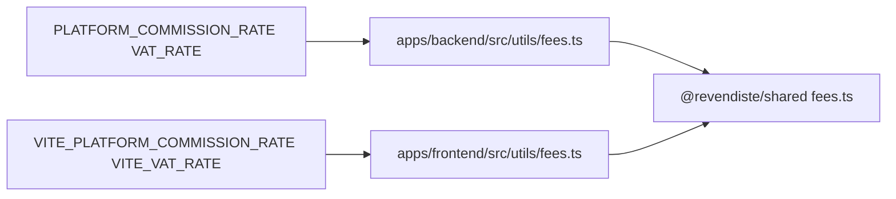

# Comisión de plataforma (PLATFORM_COMMISSION_RATE)

Este documento describe qué controla la comisión, cómo está cableada en el código y los pasos para **aumentarla o cambiarla** de forma segura.

## Qué hace la comisión

- **Comprador**: sobre el subtotal del pedido se calculan la comisión de plataforma y el IVA sobre esa comisión; el total a pagar es subtotal + comisión + IVA.
- **Vendedor**: sobre el precio de publicación se descuentan la misma comisión y el IVA sobre la comisión; el vendedor recibe el resto.

Los importes **quedan guardados en cada orden** (`platformCommission`, `vatOnCommission`, `subtotalAmount`, `totalAmount`, etc.). Cambiar la variable de entorno **no modifica órdenes ya creadas**; solo afecta cálculos y textos que dependen del valor vigente al momento de la operación o del render.

## Variables de entorno

| Entorno | Variable | Ejemplo (6%) |
|---------|----------|--------------|
| Backend | `PLATFORM_COMMISSION_RATE` | `0.06` |
| Backend | `VAT_RATE` | `0.22` |
| Frontend | `VITE_PLATFORM_COMMISSION_RATE` | `0.06` |
| Frontend | `VITE_VAT_RATE` | `0.22` |

- Valores en **decimal** entre `0` y `1` (validado con Zod en [apps/backend/src/config/env.ts](../src/config/env.ts) y [apps/frontend/src/config/env.ts](../../frontend/src/config/env.ts)).
- **Backend y frontend deben usar el mismo par** de comisión e IVA; si no coinciden, los textos y cálculos del cliente no reflejarán lo que persiste el API.

## Flujo en el código

- Los wrappers llaman a `getFeeRates()` / `getFeeRatesDisplay()` para porcentajes enteros en UI y emails.
- Los servicios de órdenes usan `calculateOrderFees` del backend para persistir montos al crear la reserva/pedido.

## Cómo aumentar o cambiar la comisión

1. **Definir el nuevo valor** (ej. 7% → `0.07`) y el IVA si también cambia (en Uruguay suele mantenerse alineado con la normativa vigente).

2. **Backend**
   - Establecer `PLATFORM_COMMISSION_RATE` y `VAT_RATE` en el entorno de despliegue (Secrets / variables del servicio / `.env` local).
   - Referencia en ejemplo local: [apps/backend/.env.example](../.env.example).

3. **Frontend**
   - Establecer `VITE_PLATFORM_COMMISSION_RATE` y `VITE_VAT_RATE` en el build de Vite (archivos `.env`, CI/CD, o variables del hosting). **Vite solo inyecta variables que empiezan con `VITE_`.**

4. **Desplegar**
   - Hacer **build y deploy del frontend y del backend** con las nuevas variables. Un solo lado actualizado genera inconsistencias.

5. **Términos y condiciones**
   - El archivo [apps/frontend/src/assets/documents/tos.md](../../../frontend/src/assets/documents/tos.md) es Markdown estático: los porcentajes y ejemplos numéricos deben **actualizarse a mano** cuando cambie la comisión (hay un comentario HTML al inicio que lo recuerda).

6. **FAQ**
   - La página de preguntas frecuentes usa las variables `VITE_*` y los mismos helpers de fees; no requiere editar textos fijos salvo que quieras cambiar el precio de ejemplo (constante en código).

7. **Emails**
   - El email de pedido confirmado recibe los porcentajes desde el backend al armar la plantilla ([apps/backend/src/services/notifications/email-template-builder.ts](../../src/services/notifications/email-template-builder.ts)); no hace falta tocar la plantilla salvo cambios de redacción.

8. **Probar**
   - Checkout / resumen de orden / publicación de entrada: montos y etiquetas con el nuevo porcentaje.
   - Crear una orden de prueba y verificar totales e invoice/FEU si aplica.

## Infraestructura (Terraform / ECS)

Hoy la comisión puede no estar declarada en Terraform y depender del **default** del esquema Zod (`0.06`). Para producción es recomendable **definir explícitamente** `PLATFORM_COMMISSION_RATE`, `VAT_RATE` en la definición de tareas del backend y las `VITE_*` en el pipeline de build del frontend, para que los cambios sean auditables y no dependan solo del código.

## Resumen de riesgos

- **Órdenes históricas**: no se recalculan; siguen con los montos guardados.
- **Desalineación FE/BE**: errores de confianza y posibles discrepancias si el cliente calcula con un rate y el servidor con otro.
- **Legal**: actualizar TOS y cualquier comunicación oficial que cite porcentajes fijos.
