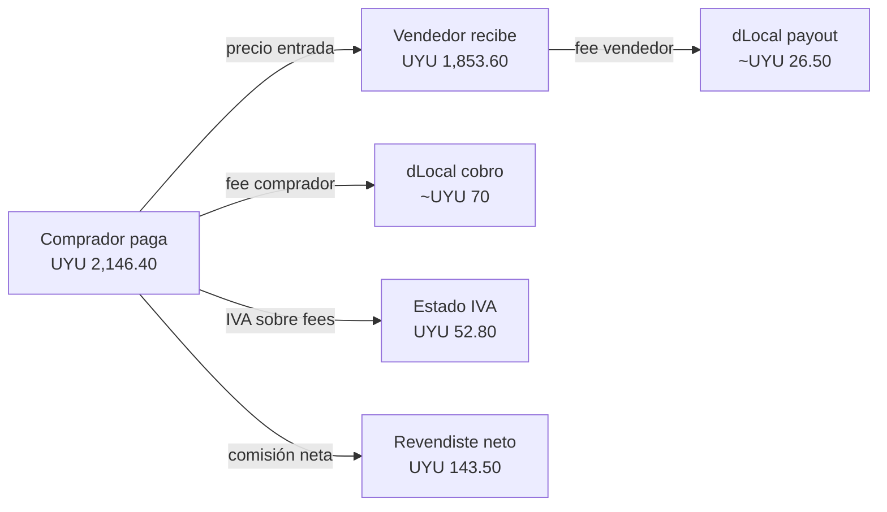
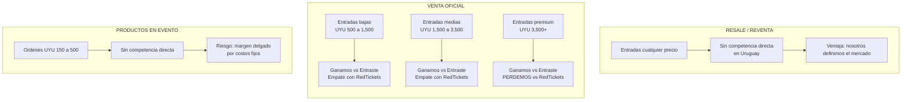

# Revendiste: Decisiones comerciales pendientes

## Propósito de este documento

Este documento resume las decisiones comerciales que necesitamos tomar como equipo respecto a la estructura de comisiones de Revendiste, tanto para el lanzamiento como para la evolución del modelo de negocio.

No es un análisis técnico exhaustivo, es un documento para discutir y decidir. El análisis detallado con los números, fórmulas y justificaciones está en [`revendiste-fee-strategy-analysis.md`](./revendiste-fee-strategy-analysis.md).

Está organizado en tres bloques de decisiones:

1. Reventa de entradas
2. Venta oficial de entradas
3. Productos dentro del evento (bebidas, cigarrillos, etc.)

## Contexto base que conviene entender antes de decidir

### Qué significa realmente nuestra comisión actual

Hoy cobramos `6% + IVA` al comprador y `6% + IVA` al vendedor. Eso suena bajo, pero en la práctica implica:

- Un fee visible del `7.32%` a cada lado en Uruguay
- Una cuña total del `14.64%` entre lo que paga el comprador y lo que recibe el vendedor
- Un ingreso real para Revendiste del `12%` del valor de la entrada, antes de costos

El IVA **no es ingreso**. Es un pasaje al Estado. El ingreso real es solo el `12%`.

### Cuánto se queda dLocal

En promedio, dLocal se lleva aproximadamente el `40%` de nuestro ingreso por comisión, considerando:

- Costo de cobro (variable según método de pago)
- Costo de payout al vendedor
- IVA sobre esos costos (que tratamos como costo real por prudencia)

Esto significa que nuestro margen real antes de gastos operativos, soporte y reembolsos es mucho menor de lo que parece.

### Panorama competitivo en Uruguay

Estos son los tres competidores relevantes en Uruguay para venta oficial de entradas. Ninguno opera reventa como producto principal, por lo que la comparación directa aplica para venta oficial.

| Plataforma     | Fee al comprador                                                                          | Fee al productor/vendedor                      | Notas                                                                           |
| -------------- | ----------------------------------------------------------------------------------------- | ---------------------------------------------- | ------------------------------------------------------------------------------- |
| **Entraste**   | `10% + IVA`                                                                               | `UYU 40 + IVA` online, `UYU 30` físico         | Estructura pública y conocida. Fee variable por ticket en porcentaje.           |
| **RedTickets** | Cargo de servicio fijo (ejemplo público: `UYU 110` sobre entrada de `UYU 2,500` ≈ `4.4%`) | Estructura negociada caso a caso, no publicada | Ejemplo documentado: María Becerra `UYU 2,500` → `UYU 2,610` para el comprador. |
| **Tickantel**  | No pública. Estructura típica de ticketera tradicional, percibida como alta.              | No pública. Conocida por no ser transparente.  | Propiedad de Antel. Dominante en eventos deportivos y teatros grandes.          |

#### Observaciones importantes sobre el panorama

- **Entraste es el único competidor con estructura de fees 100% pública.** Por eso es nuestro benchmark principal.
- **RedTickets usa un modelo híbrido**: fee fijo al comprador (no porcentaje puro) y negociación directa con el organizador. Esto es operativamente ventajoso para entradas caras porque el fee como porcentaje baja al crecer el precio (ver ejemplos más abajo).
- **Tickantel es la opción "default" del mercado**, no necesariamente la más competitiva en precio. Los organizadores la usan por tradición y escala, no por costo.

### Ejemplo concreto para anclar la conversación

Sobre una entrada de reventa de `UYU 2,000`:

| Concepto                                        |          Monto |
| ----------------------------------------------- | -------------: |
| Precio de la entrada                            |    `UYU 2,000` |
| Lo que paga el comprador                        | `UYU 2,146.40` |
| Lo que recibe el vendedor                       | `UYU 1,853.60` |
| Ingreso bruto de Revendiste antes de IVA        |      `UYU 240` |
| IVA que remitimos al Estado                     |    `UYU 52.80` |
| Costo estimado de dLocal (cobro + payout local) |    `UYU 96.50` |
| Contribución neta aproximada para Revendiste    |   `UYU 143.50` |

Visualmente, así se distribuyen los `UYU 2,146.40` que paga el comprador:

Eso es nuestra realidad económica hoy por cada entrada vendida.

## Bloque 1: Reventa de entradas

### Situación

- Hoy cobramos `6% + IVA` a cada lado.
- **No existe competencia directa en reventa en Uruguay.** Entraste, RedTickets y Tickantel venden entradas oficiales, no reventa.
- El productor no participa del flujo de comisiones en reventa.
- La comparación más cercana es con plataformas internacionales (StubHub, Viagogo) que cobran entre `15%` y `25%` al comprador más un `15%` al vendedor. En ese contexto, nuestro `6% + 6%` es extremadamente competitivo.

### Ejemplos en múltiples rangos de precio

Para dimensionar bien las decisiones, veamos qué paga cada parte en distintos niveles de precio de entrada. Todos los números usan IVA del `22%` de Uruguay.

#### Tabla de economía completa por rango de precio

| Precio entrada | Paga comprador | Recibe vendedor | Ingreso bruto Revendiste |   Cuña total |
| -------------: | -------------: | --------------: | -----------------------: | -----------: |
|      `UYU 500` |   `UYU 536.60` |    `UYU 463.40` |                 `UYU 60` |  `UYU 73.20` |
|      `UYU 800` |   `UYU 858.56` |    `UYU 741.44` |                 `UYU 96` | `UYU 117.12` |
|    `UYU 1,000` | `UYU 1,073.20` |    `UYU 926.80` |                `UYU 120` | `UYU 146.40` |
|    `UYU 1,500` | `UYU 1,609.80` |  `UYU 1,390.20` |                `UYU 180` | `UYU 219.60` |
|    `UYU 2,000` | `UYU 2,146.40` |  `UYU 1,853.60` |                `UYU 240` | `UYU 292.80` |
|    `UYU 3,500` | `UYU 3,756.20` |  `UYU 3,243.80` |                `UYU 420` | `UYU 512.40` |
|    `UYU 5,000` | `UYU 5,366.00` |  `UYU 4,634.00` |                `UYU 600` | `UYU 732.00` |

#### Contribución neta después de costos de dLocal (payout local)

| Precio entrada | Ingreso bruto | Costo dLocal estimado | Contribución neta | % del precio de entrada |
| -------------: | ------------: | --------------------: | ----------------: | ----------------------: |
|      `UYU 500` |      `UYU 60` |              `UYU 30` |          `UYU 30` |                    `6%` |
|    `UYU 1,000` |     `UYU 120` |              `UYU 52` |          `UYU 68` |                  `6.8%` |
|    `UYU 2,000` |     `UYU 240` |              `UYU 96` |         `UYU 144` |                  `7.2%` |
|    `UYU 3,500` |     `UYU 420` |             `UYU 162` |         `UYU 258` |                  `7.4%` |
|    `UYU 5,000` |     `UYU 600` |             `UYU 228` |         `UYU 372` |                  `7.4%` |

**Lectura clave:** en entradas de `UYU 500` nuestro margen es muy delgado; en entradas de `UYU 2,000+` es sano. Esto justifica por qué la decisión de payout minimum importa más en el tramo bajo.

### Decisiones a tomar

#### Decisión 1.1: ¿Mantenemos `6% + IVA` o subimos a `6.5% + IVA`?

**Recomendación:** mantener `6% + IVA` por ahora.

**Impacto de subir a `6.5% + IVA` por rango de precio:**

| Precio entrada | Ingreso a `6%` | Ingreso a `6.5%` | Diferencia | Impacto comprador | Impacto vendedor |
| -------------: | -------------: | ---------------: | ---------: | ----------------: | ---------------: |
|      `UYU 500` |       `UYU 60` |         `UYU 65` |    `UYU 5` |       `+UYU 3.05` |      `-UYU 3.05` |
|    `UYU 1,000` |      `UYU 120` |        `UYU 130` |   `UYU 10` |       `+UYU 6.10` |      `-UYU 6.10` |
|    `UYU 2,000` |      `UYU 240` |        `UYU 260` |   `UYU 20` |      `+UYU 12.20` |     `-UYU 12.20` |
|    `UYU 5,000` |      `UYU 600` |        `UYU 650` |   `UYU 50` |      `+UYU 30.50` |     `-UYU 30.50` |

Por qué mantener `6%`:

- El lift es real pero modesto en términos absolutos
- No sabemos aún qué tan sensibles son nuestros usuarios al precio
- Subir después del lanzamiento es psicológicamente difícil: mejor tener espacio para subir si lo necesitamos
- El verdadero problema de margen en reventa no es el porcentaje, es el costo fijo de payout en tickets chicos

**Momento ideal para revisar:** cuando tengamos 3-6 meses de data real con mix cross-border, tasa de reembolsos y carga de soporte.

#### Decisión 1.2: ¿Ponemos un mínimo de payout obligatorio?

**Contexto:**

dLocal nos cobra `1% + USD 0.20` por cada payout local y `1.5% + USD 0.20` por cross-border. Ese `USD 0.20` (aproximadamente `UYU 8`) es costo fijo. En payouts chicos lastima mucho.

**Costo de payout por ticket según escenario:**

| Precio entrada | Sin mínimo (1 venta) | Mínimo `UYU 1,000` | Mínimo `UYU 1,500` |
| -------------: | -------------------: | -----------------: | -----------------: |
|      `UYU 500` |          `UYU 12.63` |         `UYU 7.30` |         `UYU 6.63` |
|      `UYU 800` |          `UYU 15.41` |        `UYU 11.41` |        `UYU 10.08` |
|    `UYU 1,000` |          `UYU 17.27` |        `UYU 13.27` |        `UYU 13.27` |
|    `UYU 2,000` |          `UYU 26.54` |        `UYU 26.54` |        `UYU 26.54` |

**Opciones:**

| Opción                | Experiencia para el vendedor | Impacto en margen                        | Riesgo principal                              |
| --------------------- | ---------------------------- | ---------------------------------------- | --------------------------------------------- |
| Sin mínimo público    | Muy buena                    | Compresión leve solo en tickets bajos    | Muchos payouts chicos comen margen silencioso |
| Mínimo de `UYU 1,000` | Aceptable                    | Ahorra ~`UYU 5` por ticket en tramo bajo | Algunos vendedores frustrados                 |
| Mínimo de `UYU 1,500` | Peor                         | Ahorro marginal adicional muy chico      | Percepción de "nos retienen la plata"         |

**Recomendación:** lanzar **sin mínimo público duro**, pero con estas reglas operativas:

- El payout solo se libera después del evento (para cubrir disputas)
- Los payouts se procesan **semanalmente en batch**
- Opcionalmente, balances muy bajos se liberan en ciclo mensual

Por qué:

- Si el ticket promedio está por encima de `UYU 1,000`, el impacto económico de no poner mínimo es bajo
- Viagogo, StubHub y otras plataformas grandes tampoco muestran un mínimo público
- La confianza del vendedor vale más que el ahorro marginal
- Batcheando semanalmente capturamos gran parte del beneficio económico sin dañar la experiencia

#### Decisión 1.3: ¿Qué hacemos con Argentina y Brasil en temporada alta?

**Contexto:**

- En enero suelen haber muchos argentinos y brasileños comprando/vendiendo.
- Los payouts cross-border cuestan `1.5% + USD 0.2`, un `0.5%` más caro que los locales.
- Brasil estructuralmente es más barato que Argentina por el uso de Pix.
- Argentina es más complejo porque el `52%` del mix de pago son billeteras virtuales (MODO, Mercado Pago), y dLocal no nos pasó tarifas específicas para esa categoría.

**Recomendación:**

- Para el lanzamiento, aplicar la misma comisión (`6% + IVA`) sin importar el país del comprador ni el vendedor.
- Antes de decidir cualquier expansión formal a Argentina, **pedir a dLocal la tarifa de billeteras virtuales**.
- Monitorear qué porcentaje de payouts termina siendo cross-border.

## Bloque 2: Venta oficial de entradas

### Situación

- No es un producto que tengamos hoy, pero está en la hoja de ruta.
- **Aquí sí hay competencia directa**: Entraste, RedTickets y Tickantel.
- La clave estratégica va a ser convencer a productores/organizadores de elegirnos.
- Los pagos se van a poder procesar en batch (no es como reventa, donde hay que pagarle a muchos vendedores fragmentados).

### Benchmark detallado de competidores

#### Entraste

| Parte           | Fee                          |
| --------------- | ---------------------------- |
| Comprador       | `10% + IVA` = `12.20%`       |
| Vendedor online | `UYU 40 + IVA` = `UYU 48.80` |
| Vendedor físico | `UYU 30` sin IVA             |

#### RedTickets (basado en caso público María Becerra)

| Precio entrada ejemplo | Cargo de servicio | % efectivo para el comprador |
| ---------------------: | ----------------: | ---------------------------: |
|            `UYU 2,500` |         `UYU 110` |                       `4.4%` |
|            `UYU 4,500` |         `UYU 110` |                       `2.4%` |

El cargo fijo al comprador se vuelve más barato como porcentaje cuanto más cara la entrada. El fee al productor no es público y se negocia caso a caso.

#### Tickantel

No publica fees. Percibido en el mercado como caro tanto para el productor como para el comprador, pero nadie tiene números concretos. **Si queremos competir contra Tickantel en un pitch, tenemos que conseguir números reales.**

### Comparación de lo que paga el comprador en cada plataforma

Comparación asumiendo nuestro escenario recomendado (`9% + IVA` comprador) vs los competidores:

| Precio entrada |       Entraste | RedTickets (estimado) | Revendiste propuesta `9% + IVA` |
| -------------: | -------------: | --------------------: | ------------------------------: |
|    `UYU 1,000` | `UYU 1,122.00` |        `UYU 1,110.00` |                  `UYU 1,109.80` |
|    `UYU 2,000` | `UYU 2,244.00` |        `UYU 2,110.00` |                  `UYU 2,219.60` |
|    `UYU 3,500` | `UYU 3,927.00` |        `UYU 3,610.00` |                  `UYU 3,884.30` |
|    `UYU 5,000` | `UYU 5,610.00` |        `UYU 5,110.00` |                  `UYU 5,549.00` |

**Lecturas importantes:**

- Contra **Entraste** cortamos en todos los rangos: el comprador paga menos en todos los precios.
- Contra **RedTickets** perdemos en entradas caras porque su cargo fijo diluye su porcentaje a medida que sube el precio. En una entrada de `UYU 5,000`, RedTickets cobra `UYU 110` (`2.2%`) mientras nosotros cobramos `UYU 549` (`11%`). Esto es una **vulnerabilidad estratégica en el tramo alto**.
- Esto sugiere que quizás necesitamos un **fee tope o un cargo fijo para entradas caras** en venta oficial (ver Decisión 2.2).

### Posicionamiento competitivo: dónde ganamos y dónde perdemos

El siguiente diagrama resume visualmente contra qué competidor nos posicionamos mejor en cada segmento del mercado.

**Implicancia estratégica:** nuestra propuesta de `9%` es sólida en el tramo medio donde está la mayoría del volumen de eventos uruguayos. El flanco débil es el tramo premium, que aunque es pequeño en volumen, concentra productores grandes con poder de negociación. La Decisión 2.2 aborda esto.

### Comparación de lo que recibe el productor

Asumiendo nuestro escenario recomendado (`UYU 20 + IVA` al productor):

| Precio entrada | Entraste recibe | Revendiste propuesta recibe | Ganancia productor con Revendiste |
| -------------: | --------------: | --------------------------: | --------------------------------: |
|    `UYU 1,000` |    `UYU 951.20` |                `UYU 975.60` |                      `+UYU 24.40` |
|    `UYU 2,000` |  `UYU 1,951.20` |              `UYU 1,975.60` |                      `+UYU 24.40` |
|    `UYU 3,500` |  `UYU 3,451.20` |              `UYU 3,475.60` |                      `+UYU 24.40` |
|    `UYU 5,000` |  `UYU 4,951.20` |              `UYU 4,975.60` |                      `+UYU 24.40` |

El productor recibe aproximadamente `UYU 24.40` más por entrada con Revendiste vs Entraste, independientemente del precio. Sobre un show de `1,000` entradas, son `UYU 24,400` extra en el bolsillo del productor.

### Decisiones a tomar

#### Decisión 2.1: ¿Qué estructura de fees usamos para venta oficial?

**No debemos copiar el modelo de reventa.** Los productores son sensibles al precio y tenemos margen para atraerlos ofreciendo fees más bajos sin destruir nuestra economía.

**Opciones evaluadas en distintos precios:**

Escenario A (agresivo: `8% + IVA` comprador, `UYU 20 + IVA` productor):

| Precio entrada | Ingreso Revendiste | vs Entraste |
| -------------: | -----------------: | ----------: |
|    `UYU 1,000` |          `UYU 100` |    `-58.3%` |
|    `UYU 2,000` |          `UYU 180` |    `-25.0%` |
|    `UYU 5,000` |          `UYU 420` |    `-16.7%` |

Escenario B (balanceado: `9% + IVA` comprador, `UYU 20 + IVA` productor):

| Precio entrada | Ingreso Revendiste | vs Entraste |
| -------------: | -----------------: | ----------: |
|    `UYU 1,000` |          `UYU 110` |    `-54.2%` |
|    `UYU 2,000` |          `UYU 200` |    `-16.7%` |
|    `UYU 5,000` |          `UYU 470` |     `-6.7%` |

Escenario C (conservador: `9% + IVA` comprador, `UYU 30 + IVA` productor):

| Precio entrada | Ingreso Revendiste | vs Entraste |
| -------------: | -----------------: | ----------: |
|    `UYU 1,000` |          `UYU 120` |    `-50.0%` |
|    `UYU 2,000` |          `UYU 210` |    `-12.5%` |
|    `UYU 5,000` |          `UYU 480` |     `-4.7%` |

**Recomendación del autor:** Escenario B (`9% + IVA` comprador, `UYU 20 + IVA` productor).

Por qué:

- Le cobramos `1%` menos al comprador que Entraste en todos los rangos
- Le cobramos la mitad al productor que Entraste (`UYU 20` vs `UYU 40`)
- Nuestro ingreso baja vs Entraste pero la propuesta de valor para el productor es enorme
- Preserva una propuesta clara: "la mitad del costo para el organizador"

#### Decisión 2.2: ¿Necesitamos un tope o un cargo fijo para entradas caras?

**Contexto:** En entradas de `UYU 4,000+`, nuestro `9%` empieza a verse caro frente a RedTickets que tiene cargo fijo.

**Opciones:**

- **Opción 1:** dejar el `9%` puro y aceptar que perdemos en el tramo premium.
- **Opción 2:** definir un **cap máximo** del fee al comprador, por ejemplo "`9% + IVA` con máximo `UYU 400 + IVA`".
- **Opción 3:** estructura híbrida "`5% + UYU 100`" que replica el modelo de RedTickets.

**Recomendación:** empezar con `9%` puro para simplicidad, y evaluar agregar un cap en la primera revisión si vemos que perdemos contra RedTickets en entradas premium (shows internacionales, VIPs).

#### Decisión 2.3: ¿Tenemos un tier específico para grandes productores?

**Contexto:** los productores grandes pueden negociar fees personalizados en otras plataformas. Sabemos que RedTickets negocia caso a caso con organizadores.

**Preguntas a decidir:**

- ¿Queremos cerrar la estructura pública y negociar caso a caso con productores grandes?
- ¿O preferimos fees uniformes para mantener simplicidad?

**Recomendación:** fee público claro al lanzar, pero con flexibilidad comercial para productores de alto volumen. Podemos ofrecer:

- Reducción del fee del productor a `UYU 10 + IVA` o incluso `UYU 0` a cambio de exclusividad o volumen garantizado
- Mantener el fee al comprador siempre público y fijo

## Bloque 3: Productos dentro del evento

### Situación

- Aún no existe como producto.
- Los productos (bebidas, cigarrillos, merch, etc.) son fulfilleados por el productor/evento.
- El cobro sería por web a través de dLocal.
- **Los tickets promedio son bajos** (`UYU 100` a `UYU 600`), lo que cambia la economía drásticamente.
- **No hay competencia directa uruguaya** en este segmento, por lo que la pricing es más libre pero también más riesgosa.

### Por qué necesita un modelo propio

En órdenes de valor bajo:

- El procesamiento de pago consume un porcentaje mayor del GMV
- Los fees porcentuales visibles pesan proporcionalmente más para el comprador
- Un reembolso de una sola bebida consume mucho más margen relativo que un ticket

### Ejemplos detallados de economía

Asumiendo escenario recomendado de `10% + IVA` al productor (sin fee al comprador):

| Precio producto | Ingreso bruto | Costo dLocal | Contribución neta | % neto sobre precio |
| --------------: | ------------: | -----------: | ----------------: | ------------------: |
|       `UYU 150` |      `UYU 15` |     `UYU 10` |           `UYU 5` |              `3.3%` |
|       `UYU 300` |      `UYU 30` |     `UYU 13` |          `UYU 17` |              `5.7%` |
|       `UYU 500` |      `UYU 50` |     `UYU 18` |          `UYU 32` |              `6.4%` |
|       `UYU 800` |      `UYU 80` |     `UYU 25` |          `UYU 55` |              `6.9%` |
|     `UYU 1,500` |     `UYU 150` |     `UYU 45` |         `UYU 105` |              `7.0%` |

**Lectura clave:** debajo de `UYU 200` el negocio casi no existe. Entre `UYU 300` y `UYU 500`, es delgado pero viable. Por encima de `UYU 500`, sano.

### Decisiones a tomar

#### Decisión 3.1: ¿Modelo de comisión para productos en evento?

Depende principalmente de una pregunta: **¿los productos se compran en el mismo checkout que la entrada, o en un checkout aparte?**

**Opción A: productos bundled con la entrada**

Si el usuario agrega una bebida al mismo carrito donde tiene la entrada:

- Experiencia más fluida
- El costo de procesamiento ya está absorbido por la entrada
- Recomendación: fee al productor de `8% a 10%`, sin fee visible al comprador

**Opción B: compras standalone**

Si el usuario abre Revendiste solo para comprar una bebida antes del evento:

- Cada orden tiene su propio costo de procesamiento
- Órdenes muy chicas pueden no ser rentables
- Recomendación: fee al productor de `10% a 12%`, con un mínimo de carrito entre `UYU 400` y `UYU 500`

#### Decisión 3.2: ¿Permitimos métodos de pago con costo fijo alto en órdenes bajas?

**Contexto:** algunos métodos de pago tienen fee fijo (por ejemplo efectivo tiene `USD 0.4`, Boleto en Brasil `USD 0.5`). En una compra de `UYU 200`, ese fee fijo es desproporcionado.

**Recomendación:** limitar los métodos de pago con fijo alto a carritos por encima de cierto monto (por ejemplo `UYU 800+`), o simplemente no habilitarlos para productos en evento.

#### Decisión 3.3: ¿Cobro de IVA al consumidor final sobre los productos?

**Pregunta legal más que comercial:** los productos (bebidas, cigarrillos) tienen su propio IVA e impuestos internos. Esto excede este documento, pero hay que definir:

- ¿Revendiste factura al consumidor o factura el productor?
- ¿Quién emite la boleta/factura electrónica del producto?
- ¿Cómo se maneja el IVA del producto vs el IVA de nuestra comisión?

**Esta decisión necesita consulta con contador/estudio contable antes del lanzamiento de este producto.**

## Resumen ejecutivo de decisiones

| Tema                                 | Decisión recomendada                         | Urgencia                 |
| ------------------------------------ | -------------------------------------------- | ------------------------ |
| Fee reventa comprador                | Mantener `6% + IVA`                          | Inmediata                |
| Fee reventa vendedor                 | Mantener `6% + IVA`                          | Inmediata                |
| Mínimo de payout                     | Sin mínimo público, batchear semanalmente    | Inmediata                |
| Fee venta oficial comprador          | `9% + IVA`                                   | Antes de ese lanzamiento |
| Fee venta oficial productor          | `UYU 20 + IVA`                               | Antes de ese lanzamiento |
| Cap para entradas premium            | No al lanzamiento; revisar post-data         | Segunda iteración        |
| Fee productos en evento (bundled)    | `8% - 10%` al productor                      | Antes de ese lanzamiento |
| Fee productos en evento (standalone) | `10% - 12%` al productor + mínimo de carrito | Antes de ese lanzamiento |
| Tarifas dLocal billeteras Argentina  | Pedir cotización formal a dLocal             | Antes de expandir a AR   |
| Estructura fiscal productos evento   | Consultar con estudio contable               | Antes de ese lanzamiento |

## Preguntas abiertas para discutir en la reunión

1. ¿Estamos de acuerdo en **no mostrar un mínimo público de payout** al lanzar?
2. ¿Aceptamos lanzar venta oficial con `9% + UYU 20 + IVA`? ¿O preferimos ser más agresivos con `8% + UYU 20`?
3. ¿Nos preocupa perder contra RedTickets en entradas premium (`UYU 4,000+`)? ¿Vale la pena diseñar un cap desde el lanzamiento?
4. ¿Queremos permitir comisiones personalizadas para productores grandes?
5. ¿El modelo de productos en evento debería ser exclusivamente bundled con entrada, o también standalone?
6. ¿Cuándo está previsto el primer test de venta oficial? Esa fecha condiciona cuándo tenemos que definir ese fee.
7. ¿Hay algún productor puntual con el que ya estemos conversando cuya estructura deberíamos validar contra esta propuesta?
8. ¿Podemos conseguir números reales de Tickantel hablando con algún productor conocido?

## Próximos pasos después de esta reunión

1. Confirmar decisiones del cuadro resumen.
2. Actualizar términos y condiciones, FAQ y copys donde aparece la comisión.
3. Documentar la política de payouts (batch semanal, release post-evento) en un documento operativo separado.
4. Agendar conversación con dLocal para pedir tarifas de billeteras virtuales en Argentina.
5. Agendar consulta con contador para el tema fiscal de productos en evento.
6. Validar con 2-3 productores conocidos la estructura propuesta antes de hacerla pública.
7. Definir KPIs para revisar estas comisiones a los 3 y 6 meses del lanzamiento.

## Fuentes consultadas

- Entraste: información provista internamente por el equipo fundador.
- RedTickets: [¿Cómo vender? - Blog RedTickets](https://redtickets.net/como-vender/) y [El Observador: venta general María Becerra en RedTickets](https://www.elobservador.com.uy/nota/empieza-la-venta-general-de-entradas-para-maria-becerra-en-redtickets-precios-y-detalles-2023899460).
- Tickantel: [Tickantel - sitio oficial](https://tickantel.com.uy/inicio/) (sin información pública de fees).
- dLocal Uruguay: [Uruguay payment methods](https://www.dlocal.com/payment-processors-in-latin-america/uruguay-payment-methods-processors-e-commerce-market-dlocal/).
- dLocal Argentina: [Argentina payment methods](https://www.dlocal.com/payment-processors-in-latin-america/argentina-payment-methods-processors-e-commerce-market-dlocal/).
- dLocal Brasil: [Brazil payment methods](https://www.dlocal.com/payment-processors-in-latin-america/brazil-payment-methods-processors-ecommerce-market-dlocal/).
