# Production Infrastructure Architecture Diagram

This diagram illustrates the complete production infrastructure architecture for Revendiste.

## Diagram

```mermaid
flowchart TB
    subgraph Internet["🌐 Internet"]
        Users["👥 Users"]
        Cloudflare["☁️ Cloudflare CDN"]
    end

    subgraph VPC["🏢 VPC (10.0.0.0/16)"]
        IGW["🌉 Internet Gateway"]
        
        subgraph PublicSubnets["📡 Public Subnets (AZ-1a, AZ-1b)"]
            ALB["⚖️ Application Load Balancer<br/>HTTPS: 443<br/>HTTP → HTTPS redirect"]
            ALBSG["🔒 ALB Security Group<br/>Cloudflare IPs only"]
        end
        
        subgraph ECSCluster["🐳 ECS Fargate Cluster"]
            subgraph BackendService["Backend Service"]
                BackendTask1["Backend Task 1<br/>0.5 vCPU / 1GB<br/>Port: 3001"]
                BackendTask2["Backend Task 2<br/>0.5 vCPU / 1GB<br/>Port: 3001"]
                BackendAS["📈 Autoscaling<br/>1-10 tasks<br/>CPU: 70%<br/>Memory: 80%"]
            end
            
            subgraph FrontendService["Frontend Service"]
                FrontendTask1["Frontend Task 1<br/>0.25 vCPU / 0.5GB<br/>Port: 3000"]
                FrontendTask2["Frontend Task 2<br/>0.25 vCPU / 0.5GB<br/>Port: 3000"]
                FrontendAS["📈 Autoscaling<br/>1-10 tasks<br/>CPU: 70%<br/>Memory: 80%"]
            end
            
            ECSTasksSG["🔒 ECS Tasks Security Group<br/>Allow from ALB only"]
        end
        
        subgraph DatabaseSubnets["💾 Database Subnets (AZ-1a, AZ-1b)"]
            RDS["🗄️ Aurora Serverless v2<br/>PostgreSQL 15.4<br/>Auto-scaling: 0.5-16 ACU<br/>Encrypted at rest"]
            RDSSG["🔒 RDS Security Group<br/>Allow from ECS Tasks only"]
        end
        
        subgraph EventBridge["⏰ EventBridge Rules"]
            EB1["Sync Payments<br/>Every 5 min"]
            EB2["Notify Upload<br/>Hourly"]
            EB3["Check Payout<br/>Hourly"]
            EB4["Process Notifications<br/>Every 5 min"]
        end
        
        subgraph CronjobTasks["📋 Cronjob ECS Tasks"]
            CronTask1["Sync Payments Task"]
            CronTask2["Notify Upload Task"]
            CronTask3["Check Payout Task"]
            CronTask4["Process Notifications Task"]
        end
    end
    
    subgraph AWS["☁️ AWS Services"]
        ECR["📦 ECR Repositories<br/>Backend & Frontend"]
        SecretsManager["🔐 Secrets Manager<br/>DB Credentials"]
        CloudWatch["📊 CloudWatch Logs<br/>7-day retention"]
        KMS["🔑 KMS<br/>RDS Encryption"]
    end

    Users --> Cloudflare
    Cloudflare -->|HTTPS| ALB
    ALB -->|/api/*| BackendService
    ALB -->|revendiste.com| FrontendService
    ALB -->|www.revendiste.com| FrontendService
    
    BackendService -->|Query| RDS
    FrontendService -->|API Calls| BackendService
    
    EventBridge -->|Trigger| CronjobTasks
    CronjobTasks -->|Query| RDS
    
    ECR -->|Pull Images| BackendService
    ECR -->|Pull Images| FrontendService
    ECR -->|Pull Images| CronjobTasks
    
    SecretsManager -->|Credentials| BackendService
    SecretsManager -->|Credentials| CronjobTasks
    
    BackendService -->|Logs| CloudWatch
    FrontendService -->|Logs| CloudWatch
    CronjobTasks -->|Logs| CloudWatch
    
    KMS -->|Encryption| RDS
    
    IGW --> PublicSubnets
    
    style VPC fill:#e1f5ff
    style PublicSubnets fill:#fff4e6
    style DatabaseSubnets fill:#ffe6e6
    style ECSCluster fill:#e6f7ff
    style RDS fill:#ffe6f0
    style EventBridge fill:#f0e6ff
    style AWS fill:#f5f5f5
```

## Architecture Overview

### Key Components

1. **Internet Layer**
   - Users access through Cloudflare CDN
   - Cloudflare provides DDoS protection and caching

2. **VPC (10.0.0.0/16)**
   - Multi-AZ deployment (sa-east-1a, sa-east-1b)
   - Public subnets for ALB and ECS tasks (no NAT Gateway)
   - Database subnets for RDS (isolated)

3. **Application Load Balancer**
   - Routes traffic based on path:
     - `/api/*` → Backend service
     - All other paths → Frontend service (for `revendiste.com` and `www.revendiste.com`)
   - HTTPS enforced (HTTP redirects to HTTPS)
   - Security group restricts access to Cloudflare IPs only

4. **ECS Fargate Services**
   - **Backend Service**: 0.5 vCPU / 1GB per task, autoscaling 1-10 tasks
   - **Frontend Service**: 0.25 vCPU / 0.5GB per task, autoscaling 1-10 tasks
   - Both run in public subnets with public IPs (cost optimization)
   - Security groups allow inbound traffic from ALB only

5. **RDS Aurora Serverless v2**
   - PostgreSQL 15.4
   - Auto-scaling from 0.5 to 16 ACUs based on load
   - Encrypted at rest with KMS
   - Isolated in database subnets
   - Security group allows access from ECS tasks only

6. **EventBridge Cronjobs**
   - Sync Payments: Every 5 minutes
   - Notify Upload: Hourly
   - Check Payout: Hourly
   - Process Notifications: Every 5 minutes
   - Each triggers an ECS task that runs once and exits

7. **AWS Services**
   - **ECR**: Container image repositories
   - **Secrets Manager**: Database credentials
   - **CloudWatch Logs**: 7-day retention
   - **KMS**: RDS encryption keys

### Cost Optimizations

- **No NAT Gateways**: ECS tasks use public IPs, saving ~$64/month
- **Aurora Serverless v2**: Auto-scales based on actual usage
- **ECS Autoscaling**: Scales down during low traffic
- **EventBridge + ECS RunTask**: Cronjobs only run when scheduled

### Security Features

- Security groups follow least-privilege principle
- RDS in isolated subnets without internet access
- All traffic encrypted in transit (HTTPS)
- All data encrypted at rest (RDS, ECR, Secrets Manager)
- Cloudflare IP restrictions at ALB level

## Viewing the Diagram

This diagram can be viewed in:
- GitHub (renders Mermaid diagrams automatically)
- VS Code with Mermaid extension
- [Mermaid Live Editor](https://mermaid.live)
- Any Markdown viewer that supports Mermaid

## Updating the Diagram

When making infrastructure changes, update this diagram to reflect:
- New services or components
- Changed resource configurations
- Updated security groups or networking
- New cronjobs or scheduled tasks

